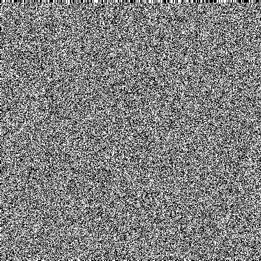
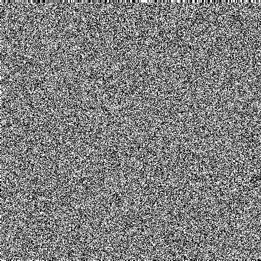
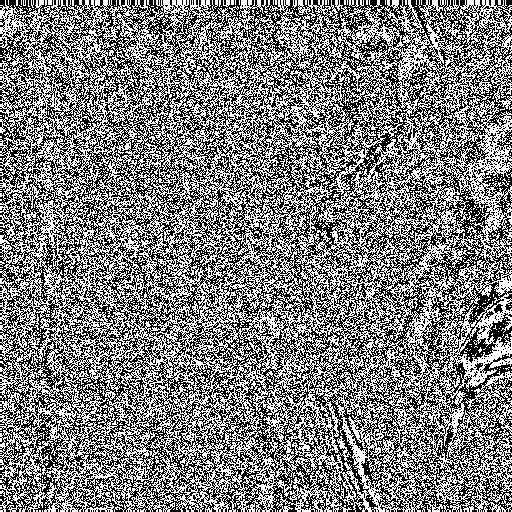
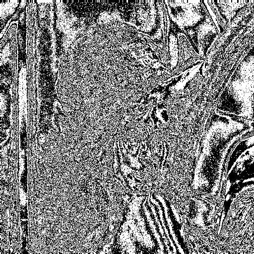
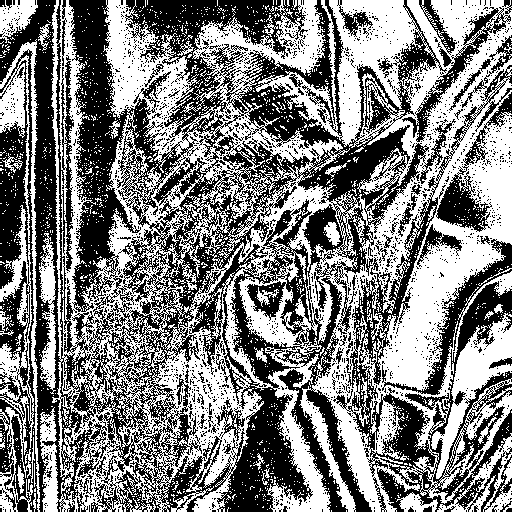
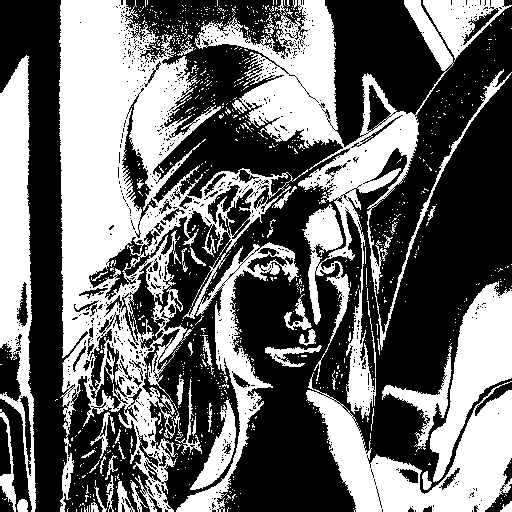

# Bit-Plane Slicing

This Python script demonstrates the process of separating a grayscale image into its 8 bit-planes. This is achieved by isolating each bit from the 8-bits that represent each pixel's gray level.

The most significant bit-plane (bit 7) contains the most significant visual information, while the least significant bit-plane (bit 0) contains the least.

### Bit-Plane Slicing

The following images show the 8 bit-planes of the original grayscale image, from the least significant bit (LSB) to the most significant bit (MSB).

| Bit 0 (LSB)                                                                | Bit 1                                                                      | Bit 2                                                                      | Bit 3                                                                      |
| -------------------------------------------------------------------------- | -------------------------------------------------------------------------- | -------------------------------------------------------------------------- | -------------------------------------------------------------------------- |
|  |  |  |  |

| Bit 4                                                                      | Bit 5                                                                      | Bit 6                                                                      | Bit 7 (MSB)                                                                |
| -------------------------------------------------------------------------- | -------------------------------------------------------------------------- | -------------------------------------------------------------------------- | -------------------------------------------------------------------------- |
|  |  |  |  |

### How to Run

1. Install the required libraries:
   ```
   pip install numpy pillow
   ```
2. Place your input image (e.g., `lena.png`) in the root directory.
3. Run the `main.py` script:
   ```
   python main.py
   ```
4. The output bit-plane images will be saved in the `Planes/` directory.
