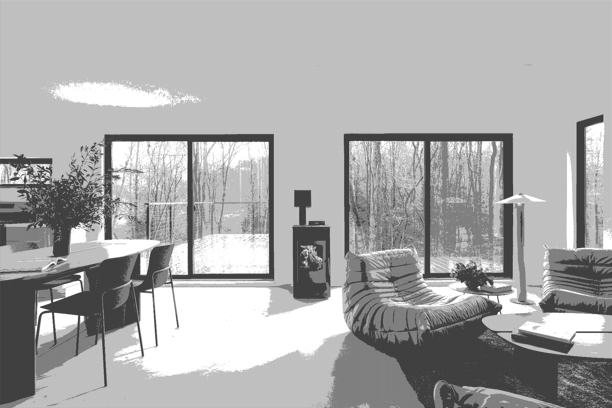
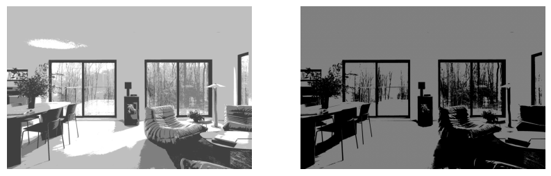
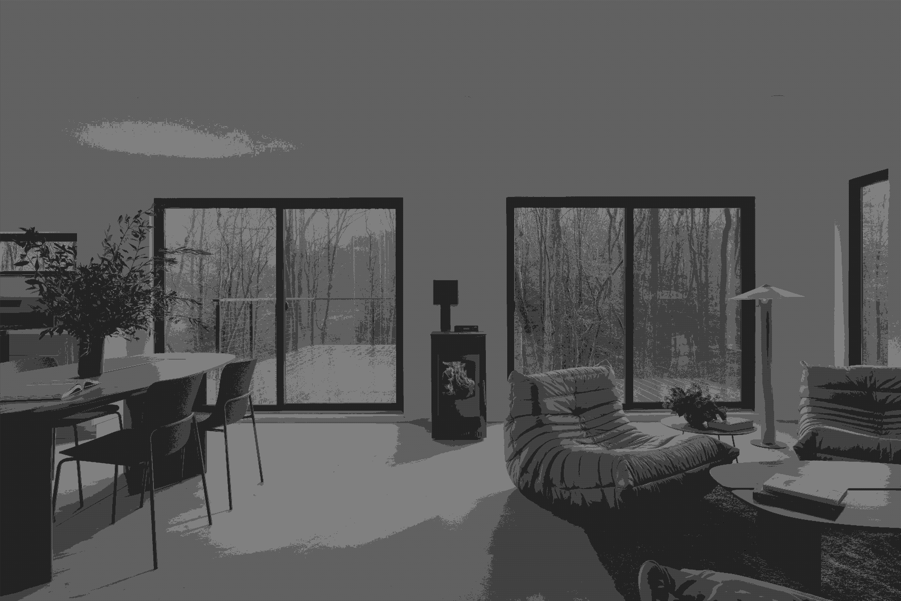

# Dithering

Dithering refers to the process of reducing the number of colors in an image. It is sometimes necessary for display, if the image must be displayed on equipment with a limited number of colors or for printing.

One immediate consequence of uniform quantization is that of false contours, mostly noticeable with fewer grayscales. One method of dealing with false contours involves adding random values to the image before quantization.

The trick is to devise a suitable matrix so that grayscales are represented evenly in the result. In this sample notebook, we use a standard matrix D which is repeated until it is as big as the image matrix, when the two are compared.

## Library Imports

```python
import os
import numpy as np
import ipyplot
import matplotlib.pyplot as plt
from PIL import Image
from IPython.display import display, HTML
```

## Constant Values

```python
data_dir = 'data/'
out_dir = 'out/'
img_title = 'clay-banks-fZHP8uq6WhQ-unsplash.jpg'
quantized_img_title = 'clay-banks-fZHP8uq6WhQ-unsplash_quantization_2.png'
```

## Image Path Definition

```python
img_path = os.path.join(data_dir, img_title)
img = Image.open(img_path)
display(img)
```


## Dither Matrix Definition

```python
dither_matrix = np.matrix([[0, 128],[192, 64]])
print(dither_matrix)
```

    [[  0 128]
     [192  64]]

## Image Preprocessing

### Retrieve Gray Pixel Values

```python
gray = img.convert('L')
img_pixels = np.array(gray).astype(np.uint8)
display(gray)
```


### Apply Dither Matrix Kernel

```python
drow, dcol = dither_matrix.shape
row, col = img_pixels.shape

# Compare and set using convolution
for i in range(0, row, drow):
    for j in range(0, col, dcol):
        for k in range(drow):
            for l in range(dcol):
                if img_pixels[i + k, j + l] > dither_matrix[k, l]:
                    img_pixels[i + k, j + l] = 1
                else:
                    img_pixels[i + k, j + l] = 0

print(img_pixels)
```

    [[1 1 1 ... 1 1 1]
     [0 1 0 ... 1 0 1]
     [1 1 1 ... 1 1 1]
     ...
     [0 1 0 ... 0 0 0]
     [1 0 1 ... 0 1 0]
     [0 1 0 ... 1 0 1]]

#### Scale for Display

```python
img_pixels = img_pixels * 255
dithered_img = Image.fromarray(img_pixels)
display(dithered_img)
```



Here we have represented the image with only two grayscale level values, either 0 (black) or 255 (white). This process is also known as **halftoning**.

We obtain a significantly appealing image which is far superior to the one we might obtain with uniform quantization as we may see in the following comparison.

#### Comparison with Simply Uniformly Quantized to 2 Grayscales Image

```python
# Save the dithered image
os.makedirs(out_dir, exist_ok=True)
img_name, _ = os.path.splitext(img_title)
dithered_img_path = os.path.join(out_dir, f"{img_name}_dithered.png")
dithered_img.save(dithered_img_path)

quantized_img_path = os.path.join(data_dir, quantized_img_title)
quantized_img = Image.open(quantized_img_path)
# Display images
fig, axs = plt.subplots(1, 2, figsize=(10, 5))
axs[0].imshow(dithered_img, cmap='gray', vmin=0, vmax=255)
axs[0].axis("off")
axs[1].imshow(quantized_img, cmap='gray', vmin=0, vmax=255)
axs[1].axis("off")
plt.show()
```



As we can see, the image obtained with the uniform quantization process using two grayscale values is darker and the obvious consequence of this process is that of the **_false contours_** obtained when we inspect the dark regions. The identification of objects is more difficult for us in the second image, whereas in the first everything is clear and the contours are distinguishable.

### Applying Uniform Quantization with 2 Grayscales to Dithered Image

```python
# Uniform Quantization Process
div = np.floor(256 / 2)
img_pixels = np.floor(img_pixels / div) * div
img_pixels = np.clip(img_pixels, 0, 255).astype(np.uint8)
print(img_pixels)

# Save resulting image
path = os.path.join(out_dir, f"{img_name}_dithered_quantized.png")
dithered_quantized_img = Image.fromarray(img_pixels)
dithered_quantized_img.save(path)
display(dithered_quantized_img)
```

    [[128 128 128 ... 128 128 128]
     [  0 128   0 ... 128   0 128]
     [128 128 128 ... 128 128 128]
     ...
     [  0 128   0 ...   0   0   0]
     [128   0 128 ...   0 128   0]
     [  0 128   0 ... 128   0 128]]



Applying quantization to the dithered image now results in an image with same level of brightness as the previously directly quantized image (0 and 128), but the features are clearer and more distinguishable.

### References

- Introduction to Digital Image Processing with MATLAB, Alasdair McAndrew, 2004
- Image : [Clay Banks - Modern living room with fireplace and forest view](https://unsplash.com/photos/modern-living-room-with-fireplace-and-forest-view-fZHP8uq6WhQ)
