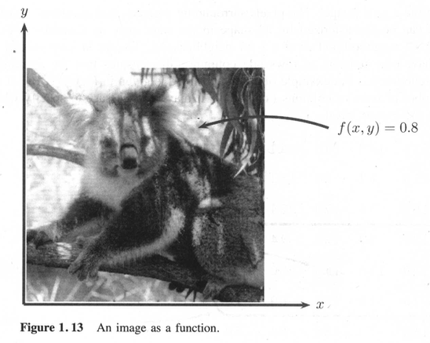
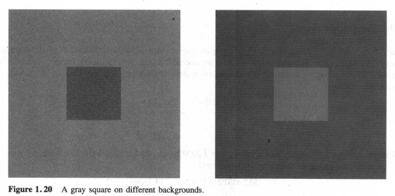
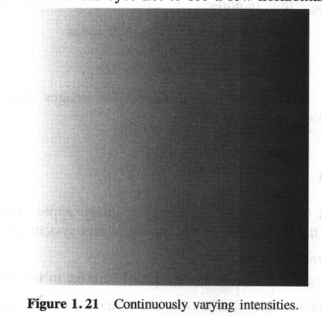

# Introduction

## Images and Pictures

An **image** is a single picture that represents _something_. Even if the picture is not immediately recognizable, it will not be just a random blur.

## What is Image Processing?

**Image processing** involves changing the nature of an image in order to either:

1. improve its pictorial information for human interpretation, or
2. render it more suitable for autonomous machine perception.

> [!NOTE]
> **_Digital image processing_** involves using a computer to change the nature of a **digital image**.

### Image Processing Operations

- **Sharpening**
  - Performed for an image to appear at its best.
- **Noise removal**
- **Motion blur**

> [!NOTE]
> **_Noise_** are random errors in the image, and each type of noise requires a different method of removal.

> [!NOTE]
> **_Motion blur_** may occur when the shutter speed of the camera is too long for the speed of the object.

## Image Acquisition and Sampling

- **Sampling** is the process of digitizing a _continuous function_.
- The **_Nyquist criterion_** can be stated as the **sampling theorem**, which says that a continous function can be reconstructed from its samples provided that the _sampling frequency_ is at least _twice_ the maximum frequency in the function.
- **Aliasing** is the phenomenon where jagged edges are present in an _undersampled_ image.
- **CCD CAMERA** (charge-coupled device camera) is an array of light sensitive cells called [photosites](https://www.cambridgeincolour.com/tutorials/camera-sensors.htm) each of which produces a voltage proportional to the intensity of light falling on them.
- The output of the camera is an array of values, each representing a sampled point from the original scene. The element of this array are called **picture elements** or **pixels**.
- **FLAT-BED SCANNER** uses a single row of _photosites_ which moves across the image, capturing it row by row as it moves in a large array.

## Images and Digital Images

> [!NOTE]
> The concept of an image as a function is vital for the development and implementation of image-processing techniques.

- **Digital images** differ from a photo in that the $x$, $y$, and $f(x, y)$ values are discrete.
- The pixels surrounding a given pixel constitute its **neighborhood**.

> [!IMPORTANT]
> Except in very special circumstances, _neighborhoods_ have odd numbers of rows and columns to ensure that the current pixel is in the _center of the neighborhood_.

## Some Applications

- Enormous range of applications
  - Almost every area of science and technology can make use of image-processing methods.

## Aspects of Image Processing

- Subdivision of image-processing algorithms into broad subclasses
- _Different algorithms_ for different tasks and problems
- Importance of distinguishing the _nature of the task at hand_

### Image Enhancement

Processing of an image so that the result is more _suitable_ for a particular application which involves:

- sharpening or deblurring an _out-of-focus_ image,
- highlighting edges,
- improving image contrast or brightening an image, and
- removing noise.

### Image Restoration

Restoration of an image from the damage done to it by a known cause, it might involve:

- blur removal caused by _linear motion_,
- removal of _optical distortions_, and
- removing _periodic interference_

### Image Segmentation

Subdivision of an image into _constituent parts_ or isolating certain aspects of an image, including:

- finding lines, circles, or particular shapes in an image, and
- identifying cars, trees, building, or roads in an aerial photograph.

> [!NOTE]
> Those procedures are not disjoint; a given algorithm may be used for both _image enhancement_ or for _image restoration_. However, we should be able to decide what it is we are trying to do with our image: simply make it better (enhancement) or remove damage (restoration).

## An Image-Processing Task

A sample real-world processing task may involve:

1. Image acquisition
2. Preprocessing
3. Segmentation
4. Representation and description
5. Recognition and interpretation

## Types of Digital Images

Four basic types are considered:

1. **Binary**: Each pixel is just black or white.
   - 1 bit per pixel
2. **Grayscale**: Each pixel is a shade of gray, normally from 0 (black) to 255 (white).
   - 8 bits per pixel
3. **True color or RGB**: Each pixel has a particular color being described by the amount of red, green and blue in it.
   - Total number of bits required for each pixel is 24, thus **_24-bit color images_**.
   - Consisted of a stack of three matrices for RGB values of each pixel
4. **Indexed**: Association of the image with a **color map** or **color palette**, which is simply a list of all the color used in _that_ image for convenience of storage and file handling.

> [!NOTE]
> In an **indexed** image, each pixel has a value that does not give its color (as for a RGB image), but an **index** to the color in the map. Without the color map, the image would be very dark.

## Image File Sizes

Image files tend to be large.

## Image Perception

Much of image processing is concerned with making an image appear better to human beings. We should therefore be aware of the _limitations_ of the human visual system.

Image perception consists of:

1. capturing the image with the eye, and
2. recognizing and interpreting the image with the **visual cortex** in the brain.

The combination and immense variability of these steps influences the ways in which we perceive the world around us.

There are number of things to bear in mind:

1. **Observed intensities** vary as to the background.
   - A single block of gray will appear darker if placed on a white background than if it were placed on a black background.
     
2. We may observe nonexistent intensities as bars in continuously varying levels.

   

3. Our visual system tends to undershoot or overshoot around the boundary of regions of different intensities.
