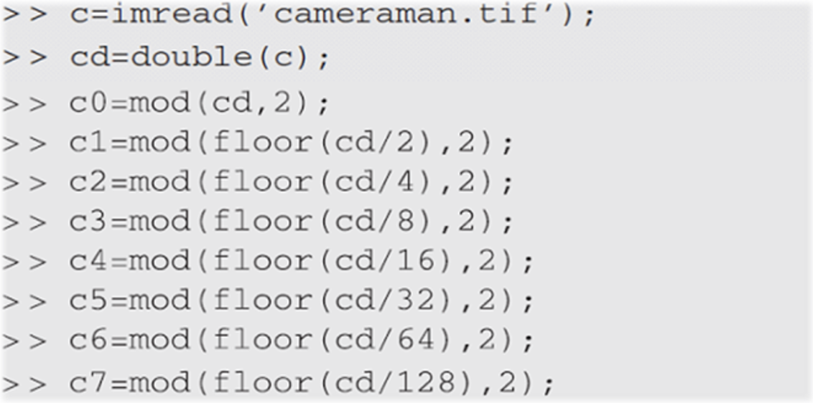
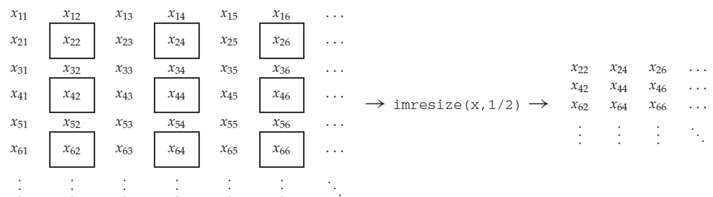
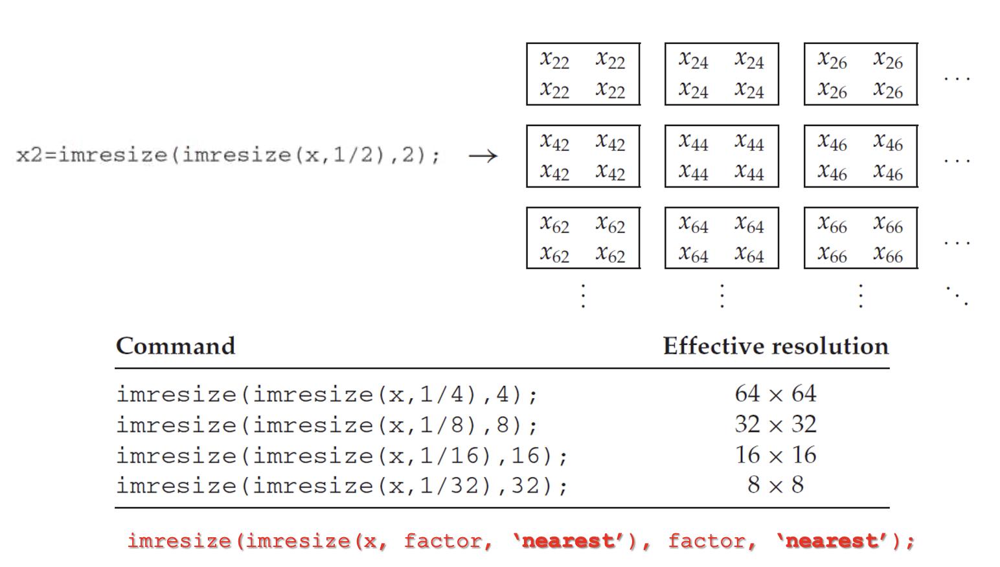
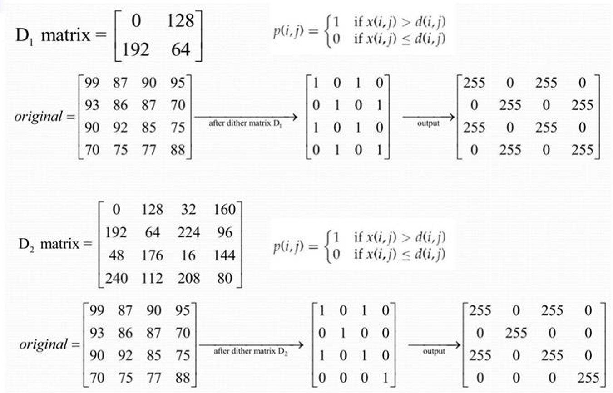
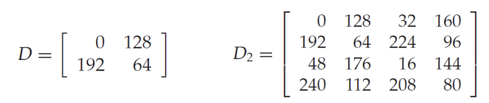
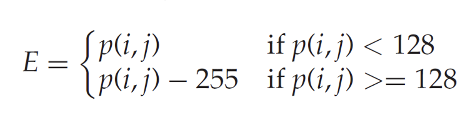
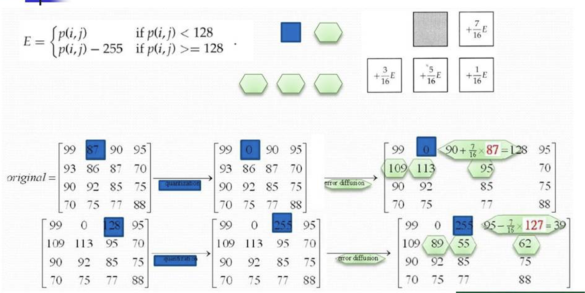

# Intro to Image Processing - Image Display (Chapter 3)

- Human vision have preference for sharp and detailed images.

## Basics of Image Display

There are many factors that will affect the image display such as:

- ambient lighting
- monitor type and settings,
- graphic card, and
- monitor resolution.

## Bit Planes

- Grayscale images can be transformed into a sequence of binary images by breaking them up into their bitplanes.
- **The zeroth bit plane**
  - least significant bit plane
- **The seventh bit plane**
  - most significant bit plane

### Extraction of Bitplanes using `MATLAB`

> [!NOTE]
> A grayscale image usually stores each pixel in an image as an 8-bit value ranging from 0 (black) to 255 (white). If you take _all_ the bits of the same order in the picture, you get a different bit plane with different brightness information. For example, taking all the _first_ bits of each pixel in an image, you get the **most significant bit plane**.

> [!NOTE]
> **Higher bitplanes** carry most of the visible structure and contrast of the image, while **lower bitplanes** mostly contain fine noise and subtle texture.

> [!NOTE]
> By recombining all the bitplanes, you can reconstruct the original image.

### Spatial Resolution

- Spatial resolution is the density of pixels over the image.
- The greater the spatial resolution, the more pixels are used to display the image.
- **ppi** (pixel per inch) and **dpi** (dot per inch)

[Spatial Resolution in Digital Imaging](https://www.microscopyu.com/tutorials/spatial-resolution-in-digital-imaging)

### Quantization and Dithering

- **Quantization**
  - number of grayscales used to present the image
    - _how many shades of gray are displayed_
- **Uniform quantization**
  - An image with only $n$ grayscales, we divide the range of grayscales into $n$ equal ranges and map the ranges to the value 0 to $n - 1$

#### Dithering

- **Dithering** refers to the process of reducing the number of colors in an image.

- Representing an image with only two tones is known as **_halftoning_**.
- Dithering matrix
  
- $D$ or $D_2$ is repeated until it is **as big as the image matrix, when the two are compared**.
- Dithering can be extended easily to more than two output gray values.

#### ERROR DIFFUSION

- The image is quantized at two levels
- For each pixel we take into account the **error between its gray value** and its **quantized value**
- The idea is to **_spread this error over neighboring pixels_**.

> [!IMPORTANT]
> **Error diffusion** is different from **normalization**, since it does not scale anything to fit a uniform range, it's redistributing the quantization error _locally_ to make smoother shading.

#### Floyd and Steinberg Method

For each pixel $p(i, j)$ in the image, we perform the following sequence of steps:

1. Perform the quantization
2. Calculate the quantization error
   

