# Intro to Image Processing - Point Processing (Chapter 4)

- Any image processing operation transforms the **gray values of the pixels**.
- Image processing operations may be divided into **three classes** based on the _information required_ to perform the operation.
  - From the most complex to the simplest:
    - **_Transforms_**
    - **_Neighborhood processing_**
      - Allow us to **change the gray level of a given pixel**.
    - **_Point operations_**
      - A pixel's gray value is changed without any knowledge of its surrounding.

## Transform Processing

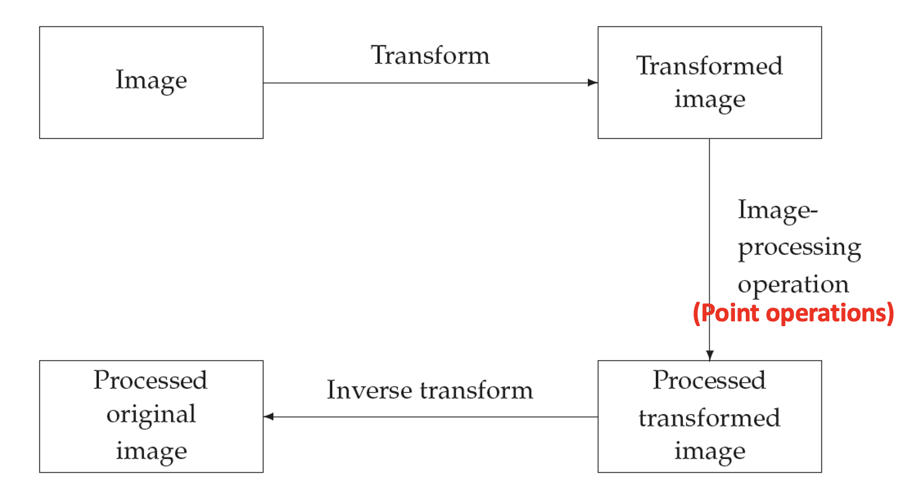

### Image Enhancement

- Emphasize and sharpen image features for display and analysis

- Application specific and developed empirically:
  - Spatial domain method: $E(r, c) = T[I(r, c)]$
  - Frequency domain method: $E(r, c) = H(r, c) * I(r, c) = F^{-1}[H(u, v) \times I(u, v)]$
  - _Point_ operation
    - Based only on the intensity of single pixel
  - _Mask_ operation
    - According to the values of the pixel's neighbors
  - _Global_ operation
    - All the pixel values in the image (or subimage)

### Transforms

- Represents the pixel values in some other, but equivalent form.
- By using a transform, the entire image is processed as a single large block.
  - Image negatives
  - Log transformations

#### Image Negative

The negative of an image with intensity level in the range $[0, L - 1]$

- $S = L - 1 - r$
  - $r$: intensity of pixel **before** processing
  - $S$: intensity of pixel **after** processing
  - $L$: number of gray levels

    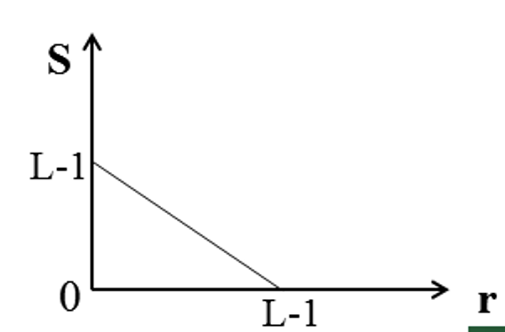

#### Log Transformations

The general form of the log transformation:

- $S = c \times \log{(1 + |r|)}$

    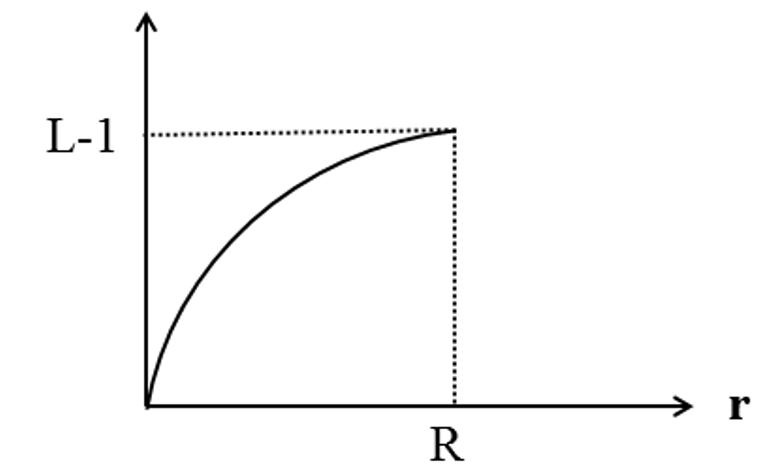

## Arithmetic Operations

- The operations act by applying a simple function: $y = f(x)$
- In each case we may have to adjust the output slightly in order to ensure that the results are integers in the $0 \dots 255$ range.
  - **type uint8**

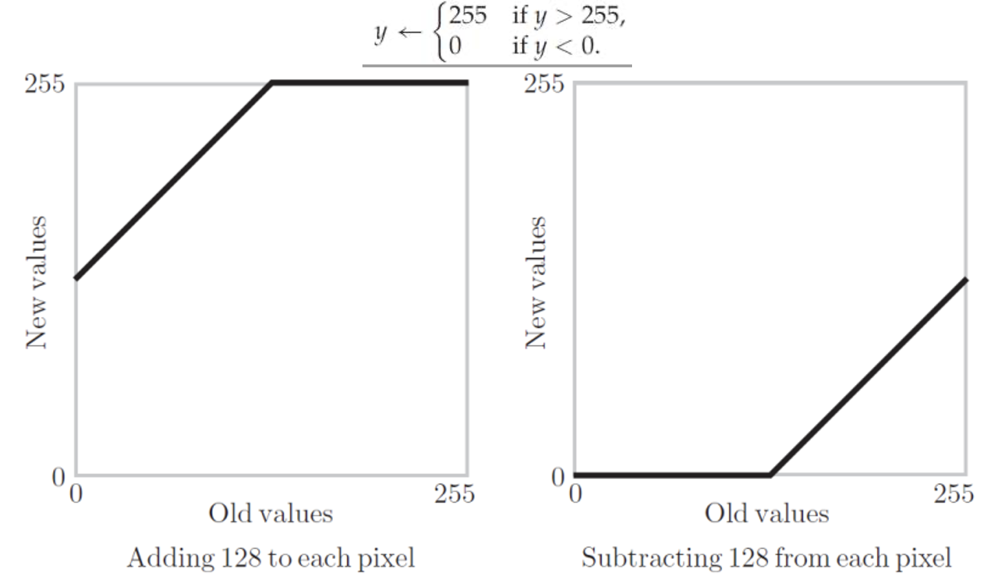

### Complements

- The **complement** of a grayscale image is its _photographic negative_
  - **type double** (0.0 ~ 1.0)
    - $1 - m$
  - **type uint8** (0 ~ 255)
    - $255 - m$

### Gray-Scale Modification

- Also called **gray-level scaling**
- Point operation
- Change the pixel's values by a mapping equation
- Typical applications
  - Contrast enhancement
    - Stretch the difference between light and dark areas in a picture to make the visual separation become clearer.
  - Feature enhancement
    - Make certain intensity variations stand out more clearly.
    - Modify pixel intensities in ways that increase the **visibility of meaningful information**

#### Gray-level Stretching

    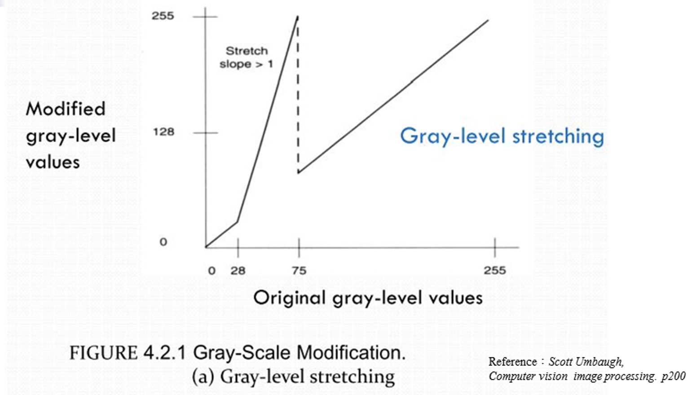

#### Gray-level stretching with clipping at ends

    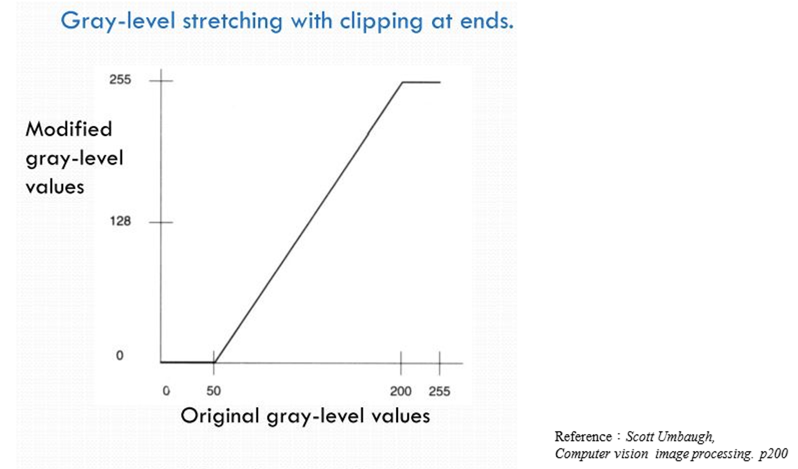

#### Intensity-Level Slicing

- Another type of mapping equation, used for feature extraction.

> [!NOTE]
> **Contrast** is the relative difference between light and dark areas of a print, digital photograph, or negative.

## Histograms

- Graph indicating the number of each times each gray level occurs in the image
- Basis for numerous spatial domain processing techniques
- Useful in image processing applications such as:
  - Image compression
  - Image segmentation
- **Histograms manipulation can be used for image enhancement**

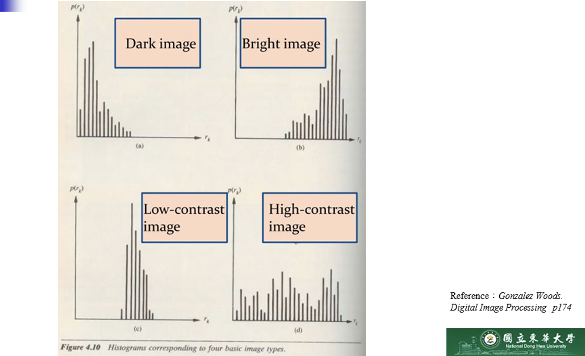

- Given a poorly contrasted image, we would like to enhance its **contrast** by **spreading out its histogram**
  - **_Histogram stretching_** (Contrast stretching)
  - **_Histogram equalization_**

### Histogram Stretching

- We use a table of $n_i$ of **gray values**

| Gray level i | 0   | 1   | 2   | 3   | 4   | 5   | 6   | 7   | 8   | 9   | 10  | 11  | 12  | 13  | 14  | 15  |
| ------------ | --- | --- | --- | --- | --- | --- | --- | --- | --- | --- | --- | --- | --- | --- | --- | --- |
| $n_i$        | 15  | 0   | 0   | 0   | 0   | 70  | 110 | 45  | 70  | 35  | 0   | 0   | 0   | 0   | 0   | 15  |

- We can stretch out the gray levels in the center of the range by applying the [piecewise linear function](https://www.cuemath.com/calculus/piecewise-function/).

> [!NOTE]
> A **piecewise linear function** is a function $f(x)$ which has different definitions in different intervals of x.

    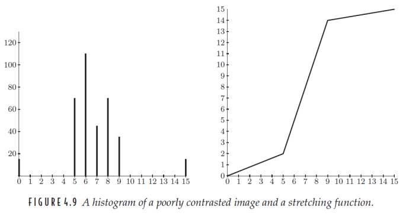

$$
j = \frac{14 - 2}{9 - 5}(i - 5) + 2
$$

- where $i$ is the **original gray level** and $j$ is its **result after the transformation**.
- This function has the effect of stretching the gray levels 5 - 9 to gray level 2 - 14

> [!IMPORTANT]
> **2 and 14** were used to **avoid saturation** and the ends of the gray scale. It also helps maintain visual balance.

- We obtain the corresponding histogram:

    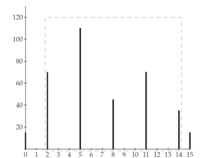

#### A Piece Wise Linear-Stretching Function

$$
y = \frac{b_{i + 1} - b_i}{a_{i + 1} - a_i}(x - a_i) + b_i
$$

- The heart of this function will be the lines.

$$
\text{pix} = \text{find}\big( (\text{im} \ge a(i)) \ \&\ (\text{im} < a(i + 1)) \big)
$$

$$
\text{out}(\text{pix}) = (\text{img}(\text{im}) - a (i)) * (b(i + 1) - b(i)) / (a (i+1) - a(i) + b(i))
$$

### Histogram Equalization

- An entirely **automatic** procedure
- Suppose our image has $L$ different gray levels $0, 1, \dots, L - 1$, and gray level $i$ occurs $n_i$ times in the image:
  $$
  \left(\frac{n_0 + n_1 + \dots + n_i}{n}\right)(L - 1)
  $$

where $n = n_0 + n_1 + n_2 + \dots + n_{L - 1}$.

#### Example

Suppose a 4-bit grayscale image has the histogram shown in the previous figure, associated with a table of the numbers of $n_i$ of gray values.

| Gray level i | 0   | 1   | 2   | 3   | 4   | 5   | 6   | 7   | 8   | 9   | 10  | 11  | 12  | 13  | 14  | 15  |
| ------------ | --- | --- | --- | --- | --- | --- | --- | --- | --- | --- | --- | --- | --- | --- | --- | --- |
| $n_i$        | 15  | 0   | 0   | 0   | 0   | 0   | 0   | 0   | 0   | 70  | 110 | 45  | 80  | 40  | 0   | 0   |

##### Histogram Equalization Procedure

We need a table which includes 5 columns which are:

- **Gray level $i$**: Each of the values of the range of gray levels
- **$n_i$**: The number of _observations_ for each gray levels in the range.
- **$\sum {n_i}$**: Sum of the observations for the gray level $i$.
- **$(\frac{L - 1}{n}) \sum {n_i}$**: Cumulative probabilities
- **Rounded value**: The respective probability values rounded to the closest integer value.

Therefore, we obtain:

| Gray level $i$ | $n_i$ | $\sum n_i$ | $(\frac{L - 1}{n}) \sum {n_i}$ | Rounded value |
| -------------- | ----- | ---------- | ------------------------------ | ------------- |
| 0              | 15    | 15         | 0.625                          | 1             |
| 1              | 0     | 15         | 0.625                          | 1             |
| 2              | 0     | 15         | 0.625                          | 1             |
| 3              | 0     | 15         | 0.625                          | 1             |
| 4              | 0     | 15         | 0.625                          | 1             |
| 5              | 0     | 15         | 0.625                          | 1             |
| 6              | 0     | 15         | 0.625                          | 1             |
| 7              | 0     | 15         | 0.625                          | 1             |
| 8              | 0     | 15         | 0.625                          | 1             |
| 9              | 70    | 85         | 3.542                          | 4             |
| 10             | 110   | 195        | 8.125                          | 8             |
| 11             | 45    | 240        | 10                             | 10            |
| 12             | 80    | 320        | 13.333                         | 13            |
| 13             | 40    | 360        | 15                             | 15            |
| 14             | 0     | 360        | 15                             | 15            |
| 15             | 0     | 360        | 15                             | 15            |

Then we use the **rounded value** column from the table as $x$ axis and the **number of observations $n_i$** to plot the resulting _equalized histogram_ for the picture:

    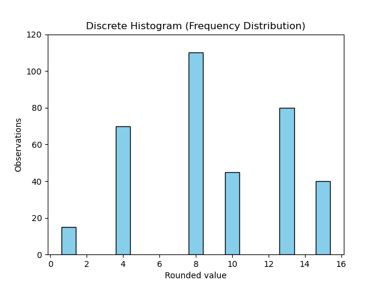

#### Why does Histogram Equalization Works?

If we were to treat the image as a **continuous function $f(x, y)$** and the histogram as the **area between different contours**, then we can treat the histogram as a **probability density function**.

#### Objectives

- Change the histogram to one that is uniform
- Each gray level in the image occurs with the same frequency
- The histogram of the resultant is **as flat as possible**

> [!IMPORTANT]
> In the case of **histogram stretching**, the overall shape of the histogram remains the same.

#### Simplified Procedure

1. Find the **running sum** of the histogram value
2. Normalization
   - Divide by the total number of pixels
3. Multiply the maximum gray level and round (truncate)
4. Mapping

## Lookup Tables

- Point operations can be performed _very effectively_ by using a **lookup table (LUT)**.
- e.g.: LUT corresponding to division by 2:
    

        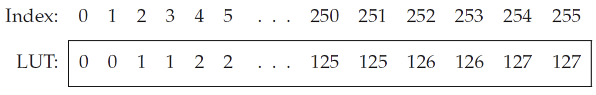
    

