# Intro to Image Processing - Neighborhood Processing (Chapter 5)

## Introduction

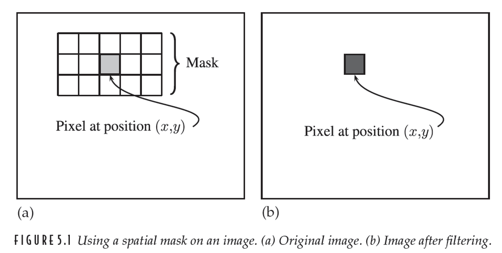

- **Neighborhood processing** may be considered as a function which is applied to a neighborhood of each pixel.
- **Mask**: Rectangle (usually with sides of _odd length_) or other shape moved over a given image.
- **Filter**: Combination of _mask_ and _function_.
- **Linear filter**: Function by which the new gray value is calculated from a linear function of all gray values in the mask.
  - Can be implemented by multiplying all elements in the mask by corresponding elements in the neighborhood and adding together all these products.

### Mask Values

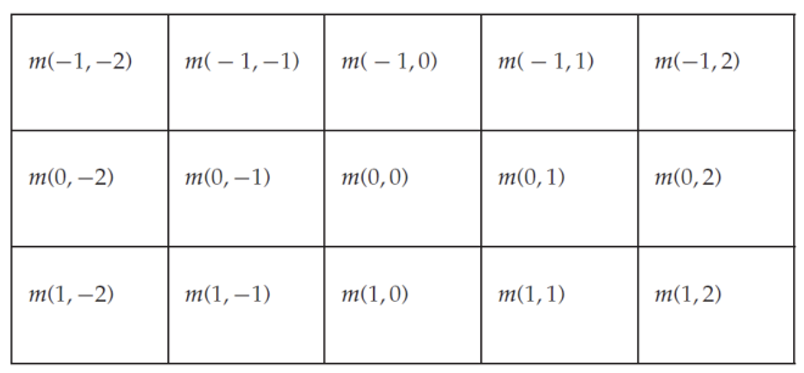

### Corresponding pixel values

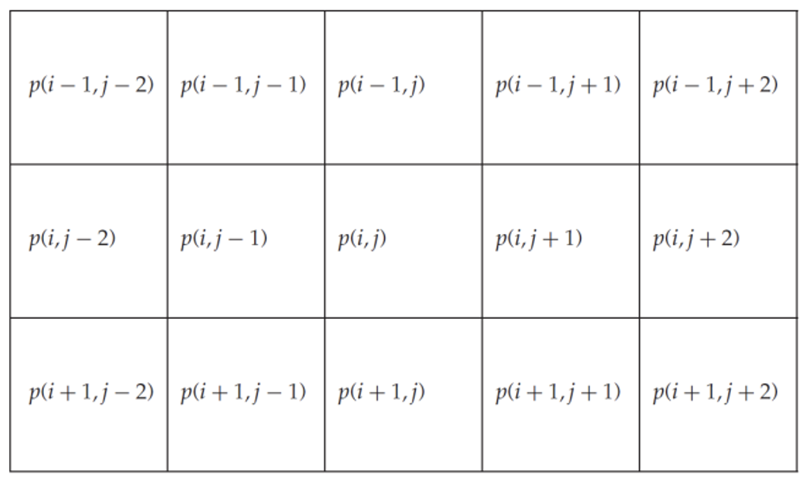

### Spatial Filtering

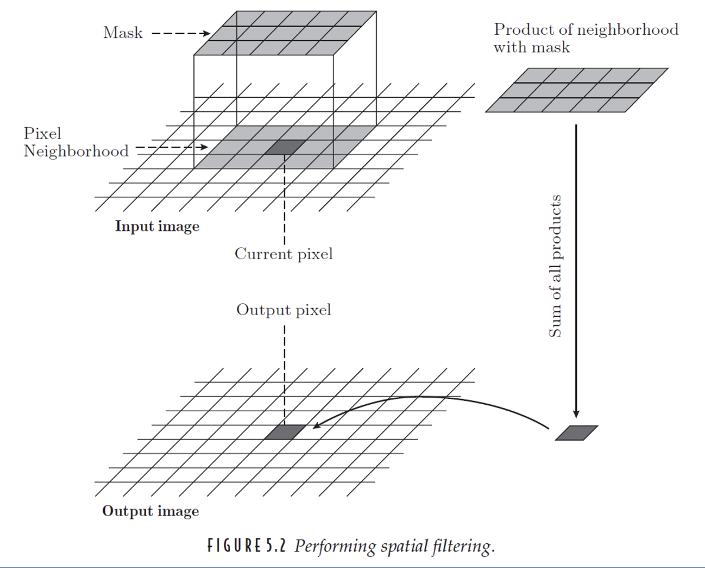

$$
\sum_{s = -1}^1 \sum_{t = -2}^2 m(s, t)p(i + s, j + t)
$$

#### Spatial Filtering Procedure

Spatial filtering requires 3 steps:

1. Position the _mask_ over the current pixel.
2. Form all products of filter elements with the corresponding element of the neigborhood.
3. Add all the products.

> [!NOTE]
> This procedure must be repeated for each pixel in the image.

#### Spatial Filtering Example

> [!IMPORTANT]
> One important _linear filter_ is to use a 3x3 mask and take the **average** of all nine values within the mask.

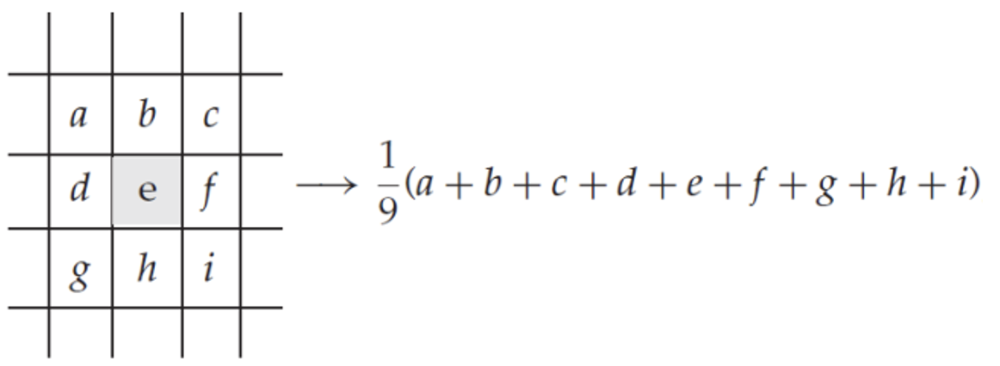

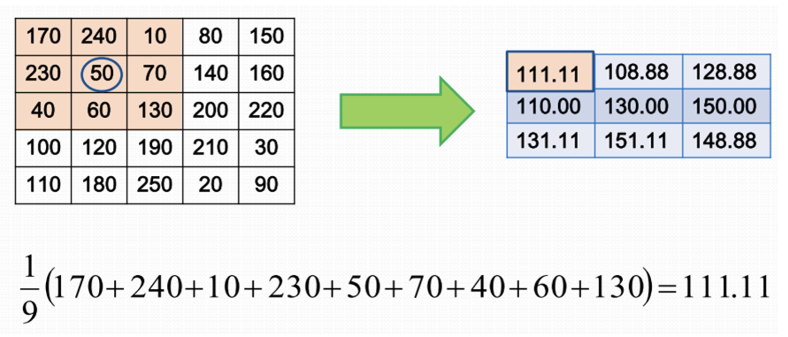

### Spatial Convolution

- Alied to _spatial filtering_ is **spatial convolution**.
- The filter must be rotated by $180^{\circ}$ before multiplying and adding:

$$
\sum_{s = -1}^1 \sum_{t = -2}^2 m(-s, -t)p(i + s, j + t)
$$

- Or the image should be rotated by $180^{\circ}$ as follows:

$$
\sum_{s = -1}^1 \sum_{t = -2}^2 m(s, t)p(i - s, j - t)
$$

#### Spatial Convolution Procedure

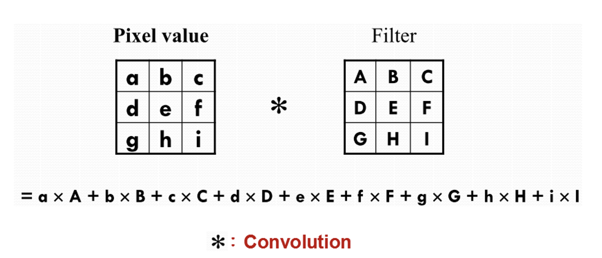

1. Overlap the mask on the subimage
2. Multiply coincident terms
3. Sum the resulting products

#### 3x3 Convolution Example

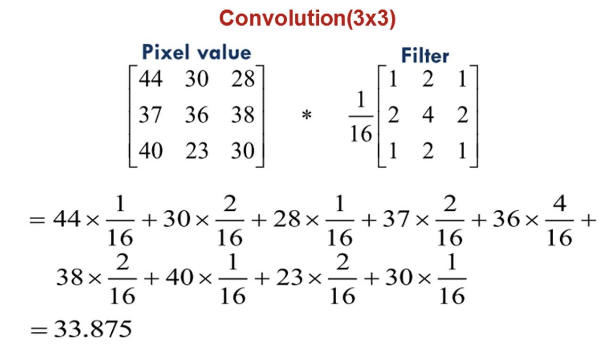

#### Convolution Using Buffer

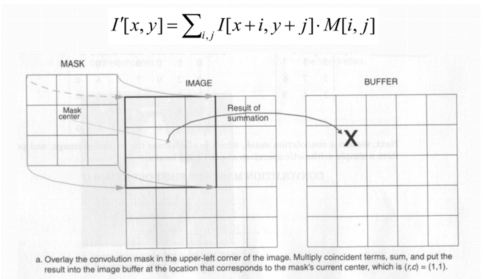

> [!IMPORTANT]
> Most filter mask are **rotationally symmetric**, so that _spatial filtering_ and _spatial convolution_ will produce the **same output**.

## Notation

- It is convenient to describe a linear filter simply in terms of the **coefficients of all gray values** of pixels within the mask.

### Averaging Filter

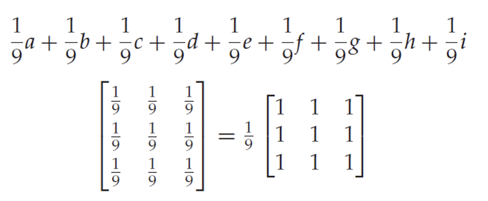

### Edges of the Image

- There are different approaches to dealing with the problem where the mask _partly falls outside of the image_.

#### Ignore the Edges

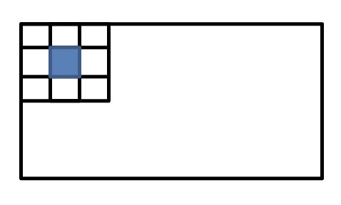

> [!NOTE]
> The mask is applied only to those pixels in the image for which mask will lie fully within the image.

#### Pad with Zeros

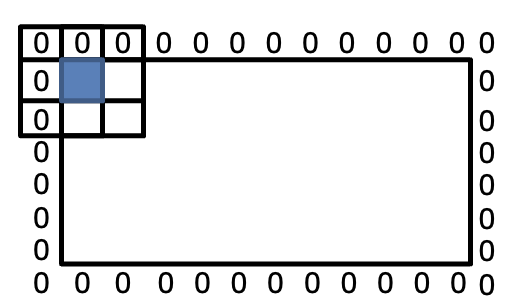

> [!NOTE]
> Assume that all necessary values outside the image are **zero**.

#### Mirroring

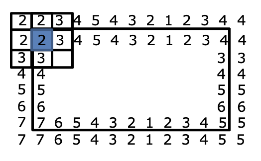

> [!NOTE]
> Assign the value of the closest pixel value to the values where the filter falls outside of the image at the edges.

## Frequencies: _Low-Pass_ and _High-Pass_ Filters

- **Frequencies** of an image are a measure of the **_amount by which gray values change with distance_**.
- **High-frequency components** are characterized by _large changes_ in gray values over _small distances_, like **edges** and **noise**.
- **Low-frequency components** are part of the image characterized by _little changes_ in the gray values, like **backgrounds** and **skin textures**.

### _High-pass_ Filter

$$
\begin{bmatrix}
1 & -2 & 1 \cr
-2 & 4 & -2 \cr
1 & -2 & 1
\end{bmatrix}
$$

- Sum of the coefficient in the high-pass filter is **zero**.
- Good at _edge detection_ and _edge enhancement_.

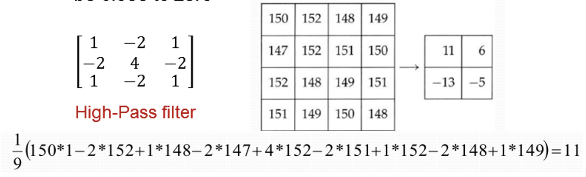

> [!NOTE]
> In a low-frequency part of an image, where the gray values are _similar_, the result of using _HP_ filter is that the corresponding gray values in the image will be close to zero.

> [!IMPORTANT] > **High-pass filter** if it passes over _high-frequency components_ and reduce or eliminates _low-frequency components_.

#### High-pass Filter Example Effect

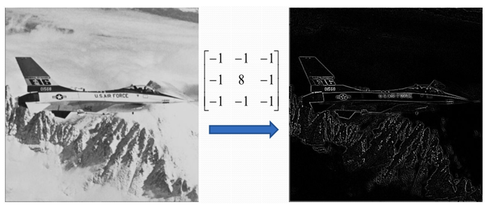

### _Low-pass_ Filter

$$
\begin{bmatrix}
1 & 1 & 1 \cr
1 & 1 & 1 \cr
1 & 1 & 1
\end{bmatrix}
$$

> [!IMPORTANT] > **Low-pass filter** if it passes over _low-frequency components_ and reduces or eliminates _high-frequency components_.

> [!NOTE]
> The **3x3 averaging filter** is a low-pass filter, because it tends to blur the edges.

#### Low-pass Filter Example Effect

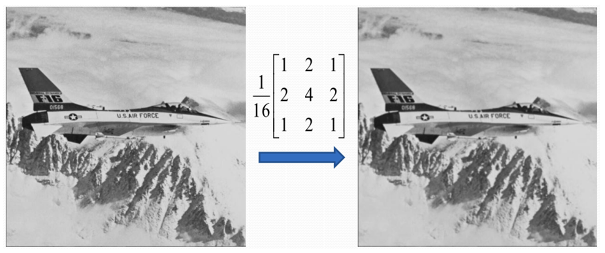

### Values Outside the Range $0-255$

- **Make the negative values positive**
- **Clip values** using:
  $$
  y =
  \begin{cases}
  0,              & x < 0,\\
  x,                & 0 <= x <= 255,\\
  255,         & x > 255.
  \end{cases}
  $$

### $0-255$ Scaling Transformation (`uint8`)

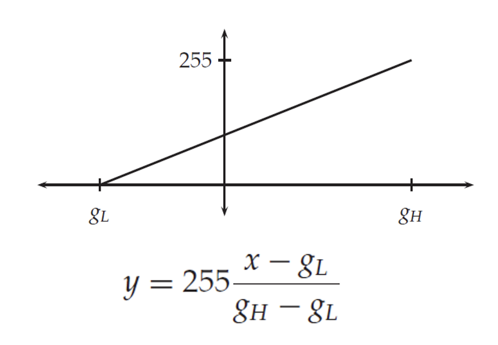

> [!NOTE] > **Scaling transformation** is a geometric operation that changes the size of an object by multiplying its coordinates by scaling factors.

### Spatial Filters

#### Low Frequency Components

- Slowly varying components
- Average intensity

#### High Frequency Components

- Edge
- Sharp details

#### Convolution Mask Operation

- _Weighted sum_ of the values of a pixel and its neighbors.
- **Coefficient of the Mask**
  - _Sum to 1_
    - The average brightness of the image will be retained.
  - _Sum to 0_
    - The average brightness will be lost and will return a **dark image**.
  - _Alternating positive and negative_
    - Returns edge information only.
  - _All positive_
    - Blur the image

### Resolution and Spatial Frequency

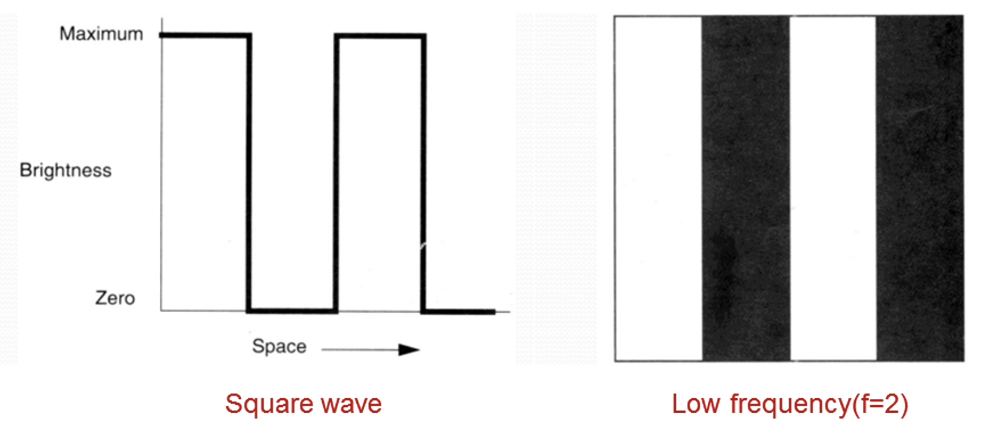

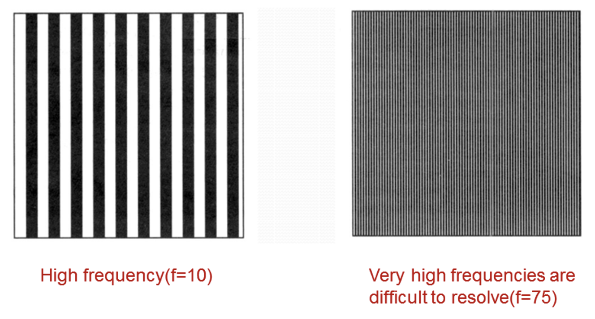

### Median Filters

- Nonlinear filter
- The center pixel is replaced with the **median value** among its neighbors.

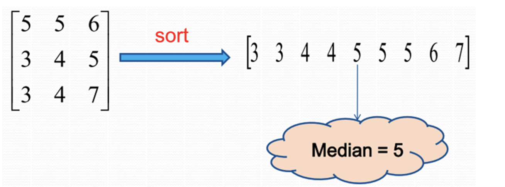

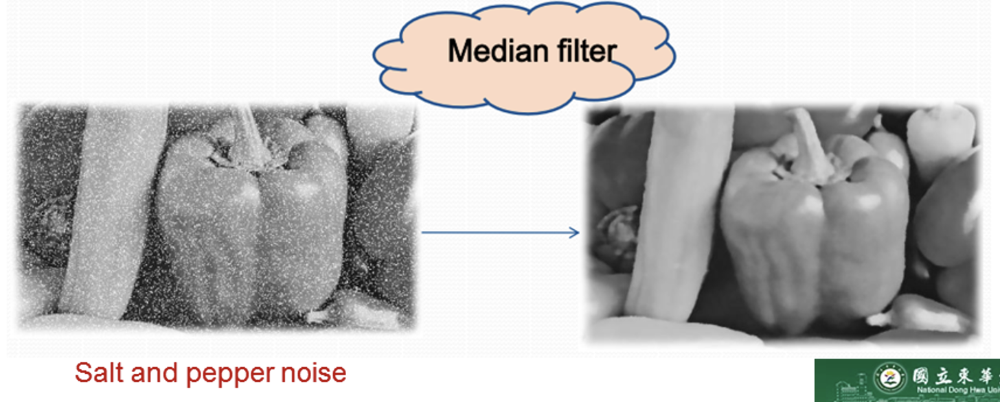

### Median Filters & Mean Filters

- Achieve _noise reduction_ rather than _blurring_
- Eliminate _intensity spike (image noise)_
- Keep and preserve sharp edges
- Create flat area
- After median filter several times -> converge to **root signals**
- When noise is **Gaussian noise** -> **_mean_** wins
- When noise is **impulse noise** -> **_median_** wins

> [!NOTE] > **Impulse noise** is a type of random noise in digital images that corrupts pixels by replacing their original values with extreme values, often black or white.

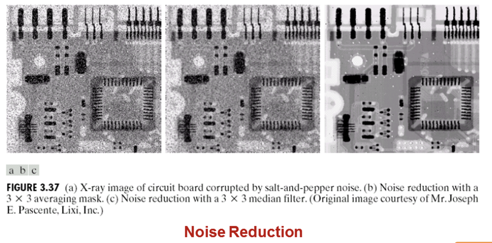

## Gaussian Filters

- Class of **LP filters**, based on the Gaussian probability function:

$$
f(x) = e^{- \frac{x^2}{2 \sigma^2}}
$$

- $\sigma$ is the _standard deviation_.
  - Measure of how spread out the observations are.
    - A large value of $\sigma$ produces a flatter curve.
    - A small value leads to a _pointier_ curve.

### Importance of Gaussian Filters

1. Mathematically **very well behaved**
   - In particular, the _Fourrier transform_ of a Gaussian filter is another Gaussian.
2. **Rotationally symmetric**
   - Very good starting point for **edge-detection algorithms**.
3. **Separable**
   - A Gaussian filter may be applied by:
     1. Applying a one dimensional Gaussian in the $x$ direction.
     2. Followed by another in the $y$ direction.
   - Lead to very fast implementations.
4. **The convolution of a Gaussian is another Gaussian.**
   - A 2D Gaussian function is given by:
     $$
     f(x,y) = e^{- \frac{x^2 + y^2}{2 \sigma^2}}
     $$

> [!NOTE]
> Although the results of **Gaussian blurring and averaging** look similar, the Gaussian filter has some elegant mathematical properties that make it particularly suitable for blurring.

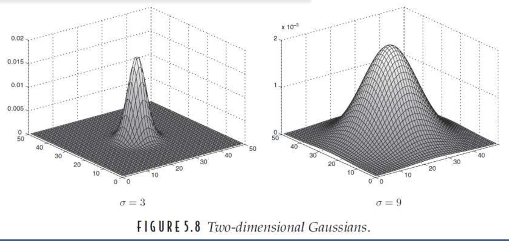

## Edge Sharpening

### Unsharp Masking

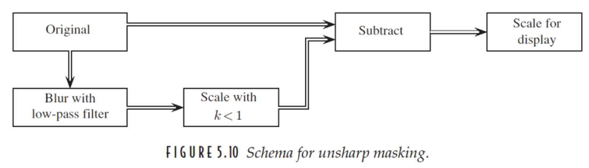

> [!NOTE]
> The sharpening process works by utilizing a slightly blurred version of the original image. This is then subtracted away from the original to detect the presence of edges, creating the unsharp mask (effectively a high-pass filter). Contrast is then selectively increased along these edges using this mask — leaving behind a sharper final image.

#### Unsharp Masking Example

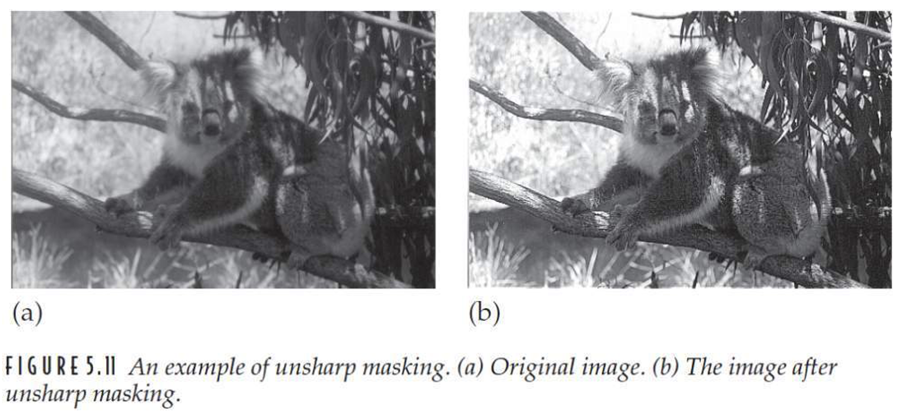

#### Unsharp Masking Substraction Operation Effect

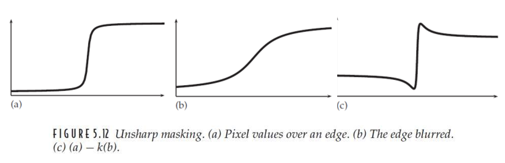

The `unsharp` option of `fspecial` in MATLAB produces such filters:

$$
\frac{1}{\alpha + 1}
\begin{bmatrix}
{- \alpha} & {\alpha - 1} & {- \alpha} \cr
{\alpha - 1} & {\alpha + 5} & {\alpha - 1} \cr
{- \alpha} & {\alpha - 1} & {- \alpha}
\end{bmatrix}
$$

#### Using Averaging Filters for Unsharp Masking

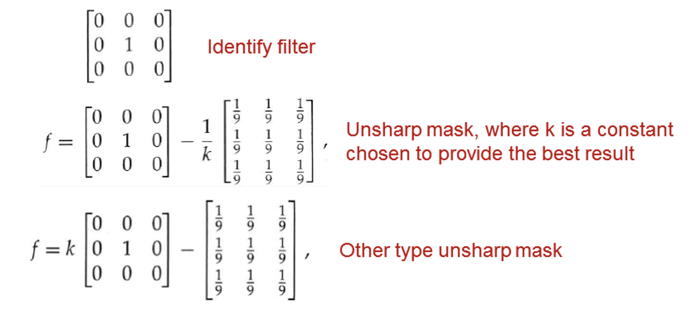

> [!NOTE]
> Any **LP filter** can be used for unsharp masking.

### High-Boost Filtering

Alied to **unsharp masking filters**:

$$
\text{high boost} = A(\text{original}) - (\text{low pass})
$$

- $A$ is an **amplification factor**.
- If $A = 1$, the _high-boost_ filter becomes an _ordinary high-pass filter_.

#### High-Boost Filter Example

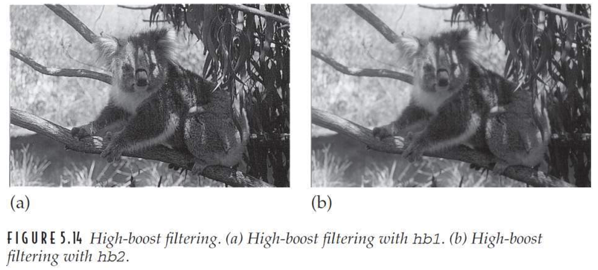

### Nonlinear Filters

- _Nonlinear function_ of the grayscale value in the mask.
  - **Maximum filter**
    - Output the max value under the mask.
  - **Minimum filter**
    - Output the min value under the mask.
  - **Median filter**
    - Output the _central value_ of the ordered list.
- Maximum and minimum filter are example of **rank-order filters**

#### Geometric Mean Filter

$$
\left( \prod_{(i, j) \in M} x(i, j) \right)^{\frac{1}{|M|}}
$$

- $M$ is the filter mask.
- _$\alpha$-trimmed_ mean filter procedure:
  1. Orders the values under the mask
  2. Trims off elements at either end
  3. Take the mean of the remainder

##### Geometric Mean Filter Example

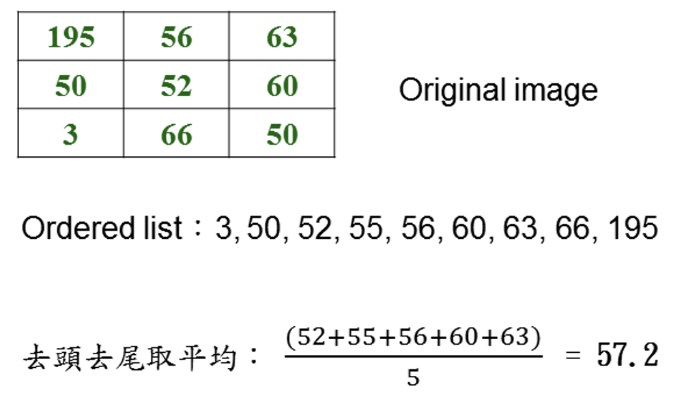

#### Example of Using Maximum and Minimum Filters

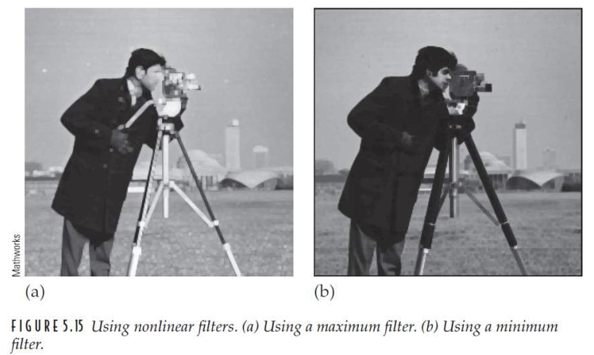

## ROI Processing

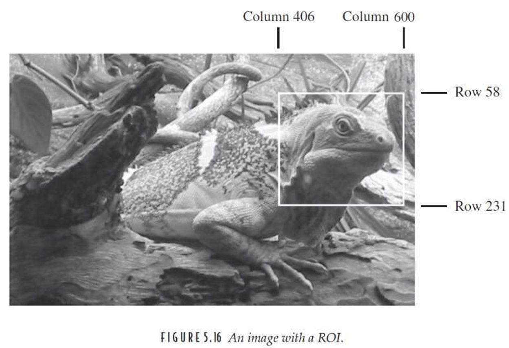

### Example Use of Filters for ROI Processing

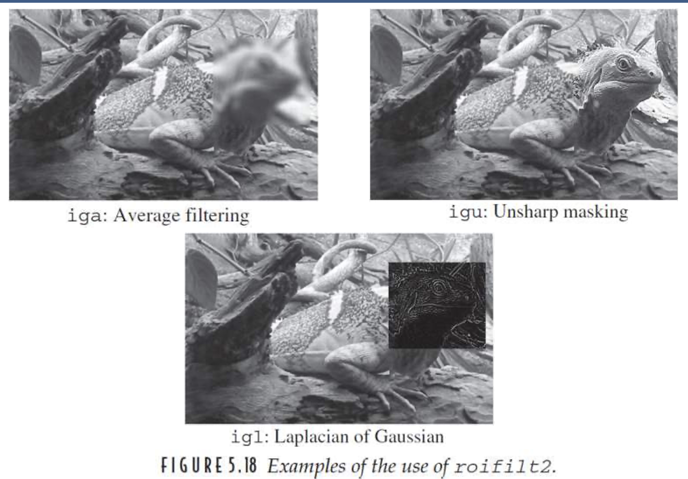

## References

- [Define Low-Pass Filter in Image Processing](https://benchpartner.com/define-low-pass-filter-in-image-processing)
- [Generation of root signal in two dimensional median filters](https://www.sciencedirect.com/science/article/abs/pii/0165168489900388)
- [Gaussian Noise](https://www.wikiwand.com/en/articles/Gaussian_noise)
- [Unsharp Masking](https://en.wikipedia.org/wiki/Unsharp_masking)
- [Sharpen image using unsharp masking - MATLAB](https://www.mathworks.com/help/images/ref/imsharpen.html)
- [SHARPENING: UNSHARP MASK](https://www.cambridgeincolour.com/tutorials/unsharp-mask.htm)
