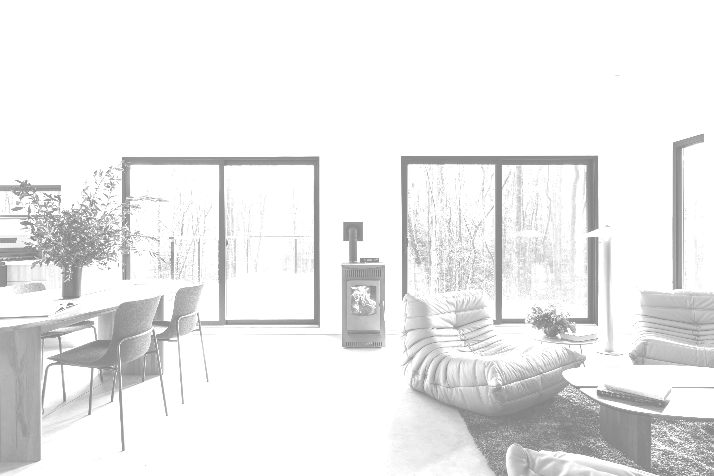
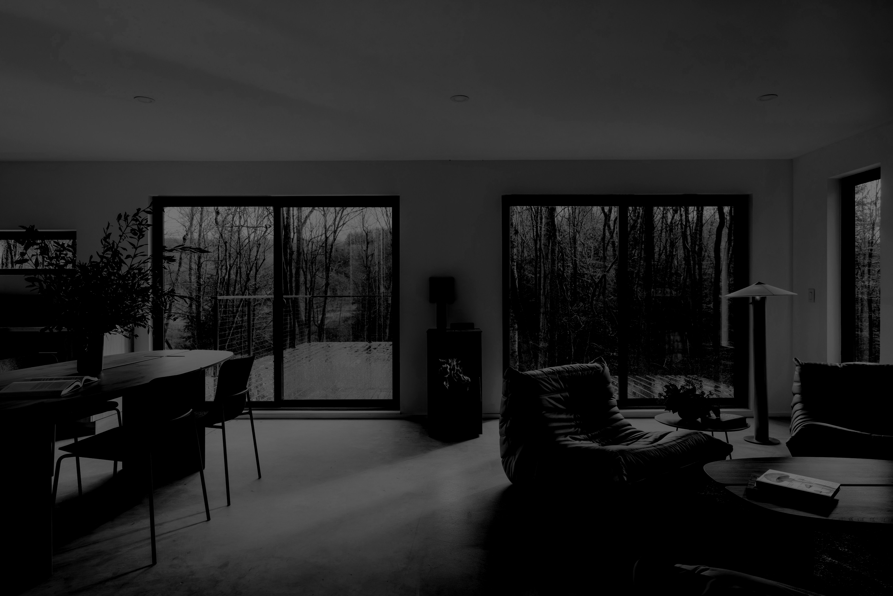
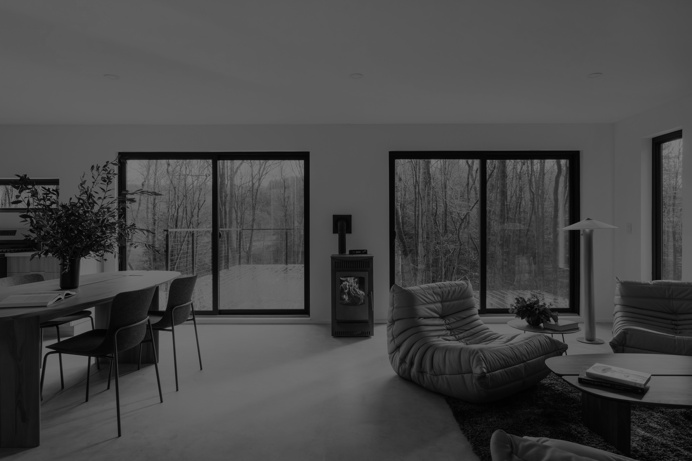
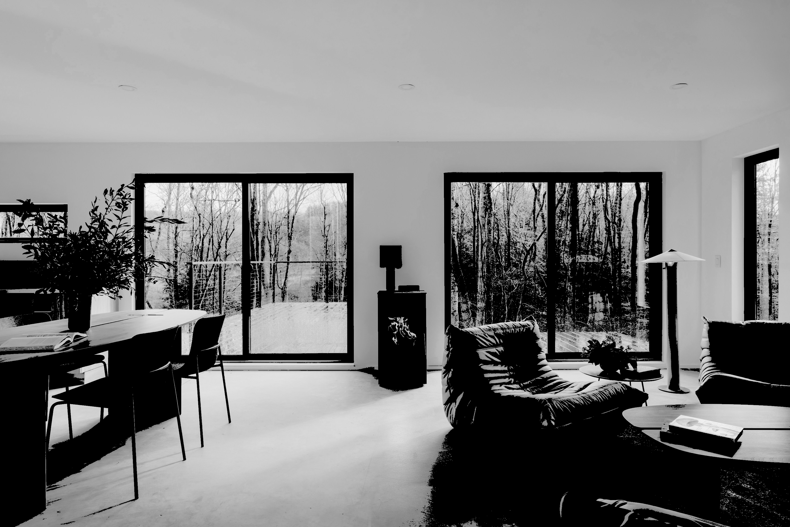
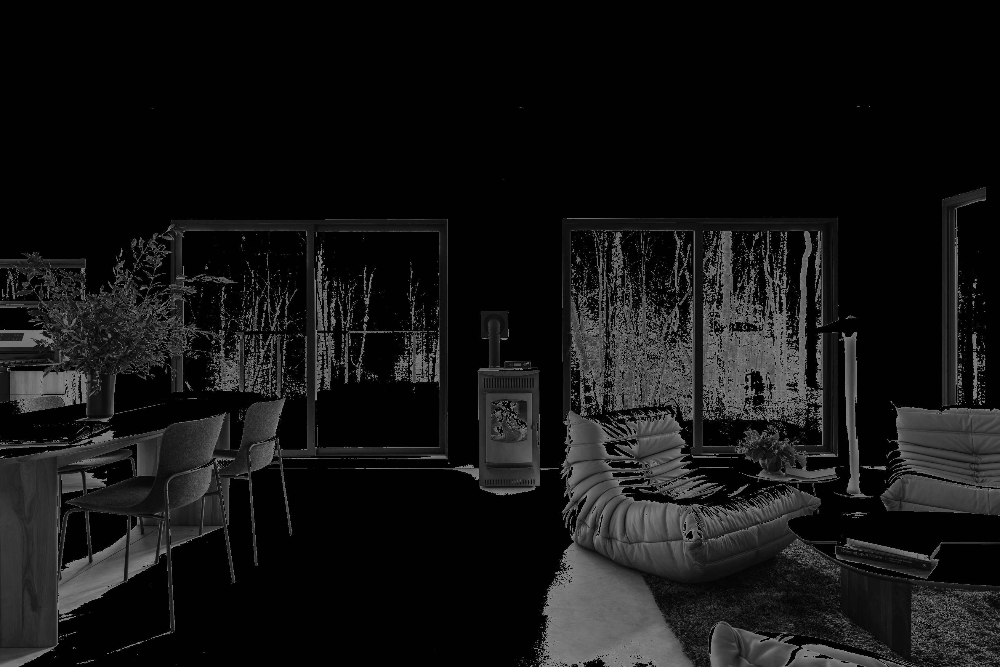

# Arithmetic Operations on Grayscale Images

In this lab, we apply different arithmetic operations on a grayscale image and discuss the resulting output from those operations if necessary.

## Library Imports

```python
import os
import numpy as np
from PIL import Image
from IPython.display import display
```

## Constants

```python
IMG_PATH = "data/clay-banks-fZHP8uq6WhQ-unsplash.jpg"
```

## Image Preprocessing

```python
img = Image.open(IMG_PATH).convert('L')
img_pixels = np.array(img).astype(np.uint8)
print(img_pixels)
display(img)
```

    [[181 181 181 ... 146 146 145]
     [181 181 181 ... 146 145 145]
     [181 181 181 ... 146 145 145]
     ...
     [115 116 117 ...  11  20  34]
     [117 118 119 ...  78  72  65]
     [118 119 119 ... 125 158 173]]


## Arithmetic Operations

### Addition

```python
img_res = np.clip(img_pixels.astype(np.int16) + 128, 0, 255).astype(np.uint8)
print(img_res)

# Display image
img_out = Image.fromarray(img_res)
display(img_out)
```

    [[255 255 255 ... 255 255 255]
     [255 255 255 ... 255 255 255]
     [255 255 255 ... 255 255 255]
     ...
     [243 244 245 ... 139 148 162]
     [245 246 247 ... 206 200 193]
     [246 247 247 ... 253 255 255]]



Adding a constant value of 128 results in a brighter image where most pixel values are most closer to a white gray value. This results in the disappearance of some edges such are in the wall corner and the details in the background are less visible.

### Substraction

```python
img_res = np.clip(img_pixels.astype(np.int16) - 128, 0, 255).astype(np.uint8)
print(img_res)

# Display image
img_out = Image.fromarray(img_res)
display(img_out)
```

    [[53 53 53 ... 18 18 17]
     [53 53 53 ... 18 17 17]
     [53 53 53 ... 18 17 17]
     ...
     [ 0  0  0 ...  0  0  0]
     [ 0  0  0 ...  0  0  0]
     [ 0  0  0 ...  0 30 45]]



Here, the details in the background are more visible since they had higher gray values before the operation. But the darker regions become less visible.

### Division

```python
img_res = np.clip(img_pixels / 2, 0, 255).astype(np.uint8)
print(img_res)

# Display image
img_out = Image.fromarray(img_res)
display(img_out)
```

    [[90 90 90 ... 73 73 72]
     [90 90 90 ... 73 72 72]
     [90 90 90 ... 73 72 72]
     ...
     [57 58 58 ...  5 10 17]
     [58 59 59 ... 39 36 32]
     [59 59 59 ... 62 79 86]]



In this case, even though the image is darker than the original, the details are still visible because all pixel values are reduced uniformly.

### Multiplication

```python
img_res = np.clip(img_pixels.astype(np.int16) * 2, 0, 255).astype(np.uint8)
print(img_res)

# Display image
img_out = Image.fromarray(img_res)
display(img_out)
```

    [[255 255 255 ... 255 255 255]
     [255 255 255 ... 255 255 255]
     [255 255 255 ... 255 255 255]
     ...
     [230 232 234 ...  22  40  68]
     [234 236 238 ... 156 144 130]
     [236 238 238 ... 250 255 255]]


In this case, the darker regions are again put more perspective whereas the previous lighter regions disappear.

## Image Complement

### Full Image Complement

```python
img_res = np.clip(255 - img_pixels.astype(np.int16), 0, 255).astype(np.uint8)
print(img_res)

# Display image
img_out = Image.fromarray(img_res)
display(img_out)
```

    [[ 74  74  74 ... 109 109 110]
     [ 74  74  74 ... 109 110 110]
     [ 74  74  74 ... 109 110 110]
     ...
     [140 139 138 ... 244 235 221]
     [138 137 136 ... 177 183 190]
     [137 136 136 ... 130  97  82]]


### Partial Image Complement

Interesting special effects can be obtained by complementing only part of the image, for example taking the complement of pixels of gray value 128 or less and leaving other pixels untouched or the inverse.

#### Case 1: Less than or equal to 128

```python
# convert to a sane dtype first
px = img_pixels.astype(np.int16)
mask = px <= 128
px[mask] = px[mask] - 255

img_res = np.clip(px, 0, 255).astype(np.uint8)

print(img_res)

img_out = Image.fromarray(img_res)
display(img_out)
```

    [[181 181 181 ... 146 146 145]
     [181 181 181 ... 146 145 145]
     [181 181 181 ... 146 145 145]
     ...
     [  0   0   0 ...   0   0   0]
     [  0   0   0 ...   0   0   0]
     [  0   0   0 ...   0 158 173]]



The background and its edges are more in perspective and the details about the dark objects are less visible.

#### Case 2: Greater to or equal to 128

```python
# convert to a sane dtype first
px = img_pixels.astype(np.int16)
mask = px >= 128
px[mask] = px[mask] - 255

img_res = np.clip(px, 0, 255).astype(np.uint8)

print(img_res)

img_out = Image.fromarray(img_res)
display(img_out)
```

    [[  0   0   0 ...   0   0   0]
     [  0   0   0 ...   0   0   0]
     [  0   0   0 ...   0   0   0]
     ...
     [116 117 118 ...  12  21  35]
     [118 119 120 ...  79  73  66]
     [119 120 120 ... 126   0   0]]



Here we have the inverse situation compared to previously where the details of most objects are visible and the background is totally absent.

```python

```
