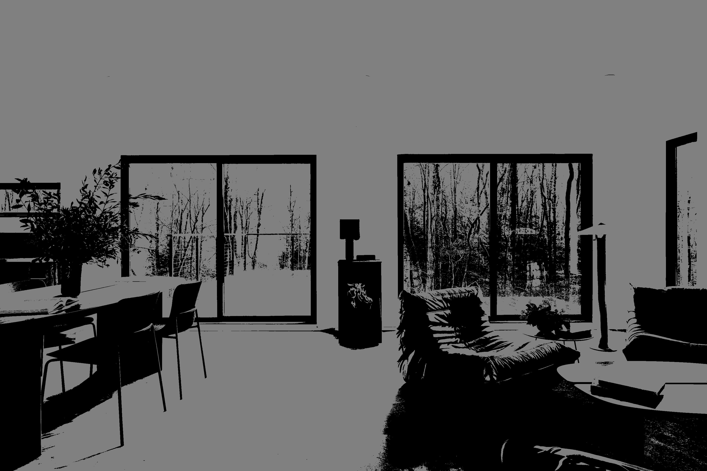
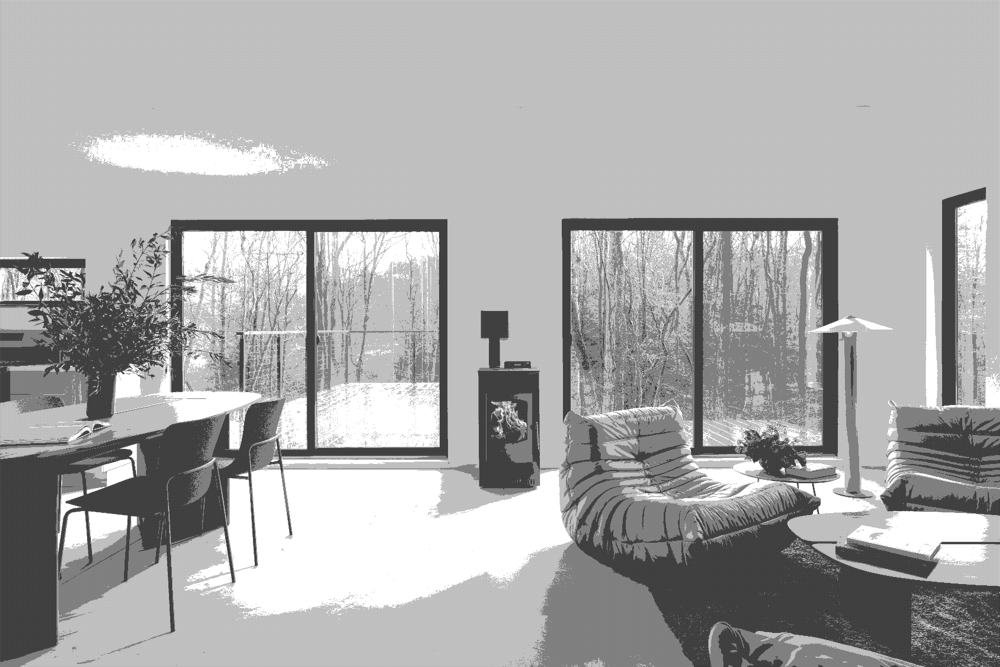
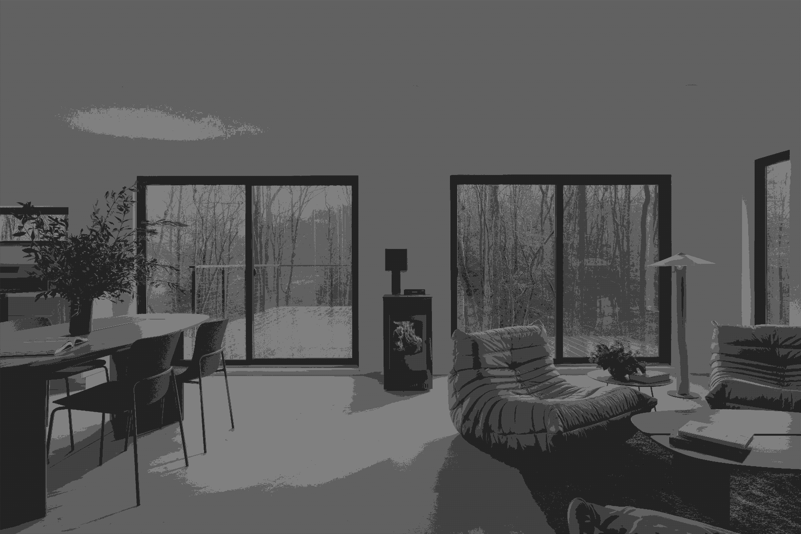

# Dithering

Dithering refers to the process of reducing the number of colors in an image. It is sometimes necessary for display, if the image must be displayed on equipment with a limited number of colors or for printing.

One immediate consequence of uniform quantization is that of false contours, mostly noticeable with fewer grayscales. One method of dealing with false contours involves adding random values to the image before quantization.

This jupyter notebook in this directory involves applying the dithering process to an RGB or grayscale image, compare with previously obtained image which used direct uniform quantization method with only two (2) grayscale values, and finaly applying the uniform quantization method to the obtained dithered image.

### Dithering Results

The following images show the effect of dithering using one standard dithering matrix.

|                                     Original Image                                     |                                            2 Grayscales                                            |                                        After Dithering                                         |                                            After Dithering and Quantization                                            |
| :------------------------------------------------------------------------------------: | :------------------------------------------------------------------------------------------------: | :--------------------------------------------------------------------------------------------: | :--------------------------------------------------------------------------------------------------------------------: |
|  |  |  |  |

This shows that applying dithering before uniform quantization can resolve the main issue of **_false contours_** encountered in applying direct uniform quantization where objects are not really distinguishable in darker regions. But when applying dithering first, the edges are sharper and clearer even though it keeps the same level of gray values (0-128).
