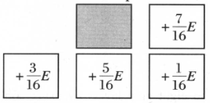
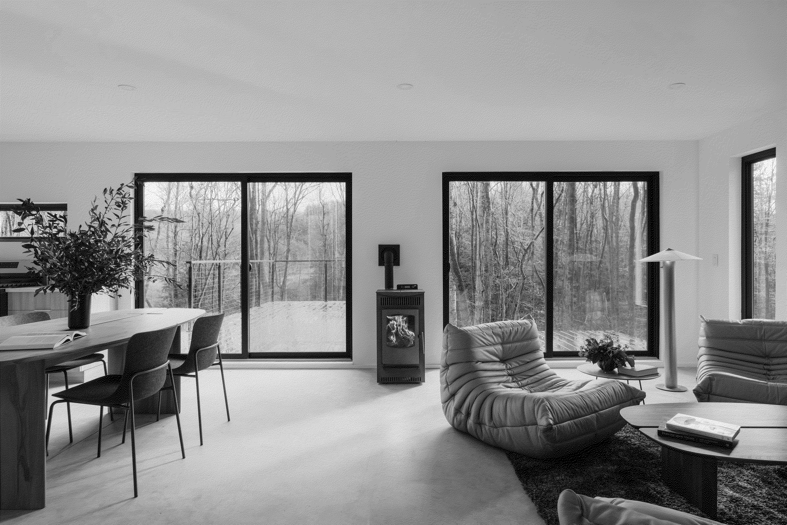
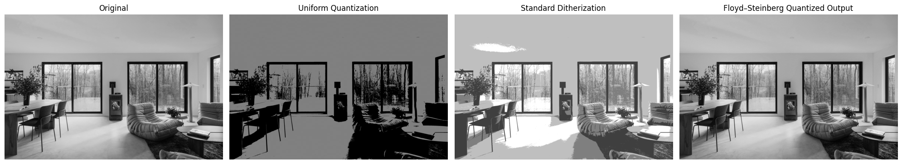

# Floyd-Steinberg Error Diffusion

A different approach to quantization from dithering is that of **error diffusion**. The image is quantized at two levels, but for each pixel we take into account the _error between its gray value_ and _its quantized value_.

In this lab, we are quantizing to gray values 0 and 255, pixels close to these values will have little error. However, pixels close to the center of the range, 128, will have a large error.

The idea is to spread this error over neighboring pixels. A popular method, developed by **Floyd and Steinberg**, works by moving through the image by pixel, starting at the top left and working across each row in turn. For each pixel $p(i, j)$ in the image, we perform the following sequence of steps:

1. Perform the quantization.
2. Calculate the quantization error. This is defined as:
   $$
    E=
    \begin{cases}
      p(i, j), & \text{if}\ p(i, j) < 128 \\
      p(i, j) - 255, & \text{otherwise}
    \end{cases}
   $$
3. Spread this error $E$ over pixels to the right and belong according to this table:

   

There are several points to note about this algorithm:

- The error is spread to pixels `before` quantization is performed on them. Thus, the error diffusion will affect the quantization level of those pixels.
- Once a pixel has been quantized, its value will never be affected because the error diffusion affects pixels only to the right and below, and we are working from the left and above.
- To implement this algorithm, we need to embed the image in a larger array of zeros so that the indices do not go outside the bounds of array.

## Procedure Implementation

### Library Imports

```python
import os
import numpy as np
import matplotlib.pyplot as plt
from PIL import Image
from IPython.display import display
```

### Constant Values

```python
IMG_PATH = 'data/clay-banks-fZHP8uq6WhQ-unsplash.jpg'
DITHERED_IMG_PATH = 'data/clay-banks-fZHP8uq6WhQ-unsplash_dithered.png'
UNIFORM_QUANTIZATION_IMG_PATH = 'data/clay-banks-fZHP8uq6WhQ-unsplash_quantization_2.png'
```

### Image Preprocessing

```python
# Open and convert to grayscale
img = Image.open(IMG_PATH).convert('L')
img_gray = np.array(img).astype(np.uint8)
```

### Floyd-Steinberg Error Diffusion

```python
def fl_stein(img: np.ndarray) -> np.ndarray:
    """
    Floyd-Steinberg error diffusion dithering for a grayscale image.
    Input:
      img : 2D numpy array, dtype uint8 (0-255)
    Returns:
      2D numpy array, dtype uint8 (0 or 255 typically, depending on thresholds)
    """
    if img.ndim != 2:
        raise ValueError("Only 2D grayscale images supported")

    # Work in float so errors accumulate precisely
    row, col = img.shape
    work = img.astype(np.float64)

    # Pad by 1 pixel on all sides to simplify neighbor indexing
    padded = np.pad(work, pad_width=((1,1),(1,1)), mode='constant', constant_values=0.0)

    result = np.zeros((row, col), dtype=np.uint8)

    for i in range(1, row + 1):
        for j in range(1, col + 1):
            old = padded[i, j]
            # Quantize this pixel (binary threshold here; replace with palette logic for multilevel)
            new = 0.0 if old < 128.0 else 255.0
            result[i-1, j-1] = np.uint8(new)
            error = old - new

            # Distribute the error to neighbors (Floyd-Steinberg weights)
            padded[i, j+1]     += (7/16) * error
            padded[i+1, j-1]   += (3/16) * error
            padded[i+1, j]     += (5/16) * error
            padded[i+1, j+1]   += (1/16) * error

    # Clip final result to valid range just in case
    return np.clip(result, 0, 255).astype(np.uint8)
```

#### Apply Procedure

```python
quantized_pixels = fl_stein(img_gray)
quantized_img = Image.fromarray(quantized_pixels)
```

### Save and Display Image Result

```python
# Save and display image
name, _ = os.path.splitext(os.path.split(IMG_PATH)[1])
path = os.path.join("out/", f"{name}_fl_stein.png")
os.makedirs("out/", exist_ok=True)
quantized_img.save(path)

print(quantized_pixels)
display(quantized_img)
```

    [[255 255 255 ... 255   0 255]
     [255   0 255 ...   0 255   0]
     [255 255   0 ... 255 255 255]
     ...
     [  0 255   0 ... 255   0   0]
     [255   0 255 ...   0 255   0]
     [  0 255   0 ...   0 255 255]]



With only two grayscale values (0 and 255), we have obtained a very accurate version of the original image in grayscale.

## Comparison with Previous Quantization Method Results

```python
# Open other images
original_img = img
dithered_img = Image.open(DITHERED_IMG_PATH)
uniform_quantized_img = Image.open(UNIFORM_QUANTIZATION_IMG_PATH)

img_list = [original_img,  uniform_quantized_img, dithered_img, quantized_img]
labels = [
    "Original",
    "Uniform Quantization",
    "Standard Ditherization",
    "Floyd–Steinberg Quantized Output"
]

# Display images
fig, axs = plt.subplots(1, len(img_list), figsize=(20, 10))
for ax, img, title in zip(axs, img_list, labels):
    ax.imshow(img, cmap='gray', vmin=0, vmax=255)
    ax.set_title(title)
    ax.axis("off")

plt.tight_layout()
plt.show()
```



As we can see, the **Floyd-Steinberg** method gives the best quantized output among the three. From a human perspective, the quality is almost the same as the original output. This denotes the efficiency, performance and superiority of the **Floyd-Steinberg** algorithm. In term of applicability, this would be a good solution for object detection, since the object features would be easily recognized from the quantized image.

### References

- Introduction to Digital Image Processing with MATLAB, Alasdair McAndrew, 2004
- Image : [Clay Banks - Modern living room with fireplace and forest view](https://unsplash.com/photos/modern-living-room-with-fireplace-and-forest-view-fZHP8uq6WhQ)
