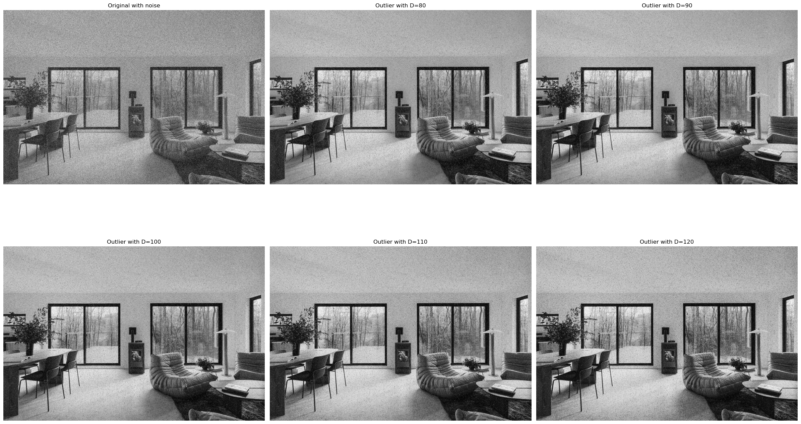
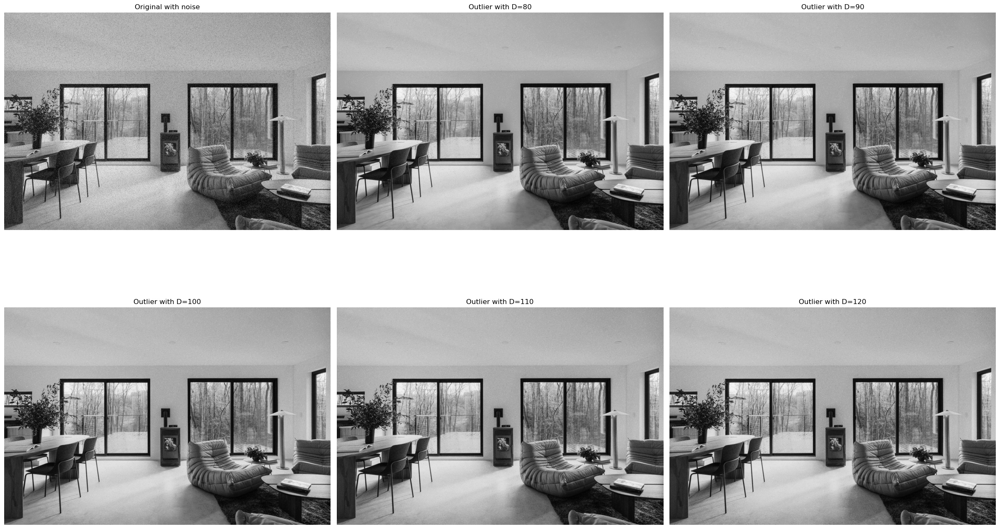

# Image Restoration - Outlier Method

In image restoration, applying the median filter to remove noise degradations can be a slow operation since each pixel requres the sorting of at least nine values when using a 3x3 mask filter.

There comes the **Outlier Method** which essentially:

- Choose a threshold value $D$
- For a givent pixel, compare its value $p$ with the mean $m$ of the values of its eight neighbors.
- If $| p - m | > D$, then classify the pixel as noisy, otherwise not.
- If the pixel is noise, replace its value with $m$; otherwise leave its value unchanged.

## Method Implementation

### Library Imports

```python
import numpy as np
import matplotlib.pyplot as plt
import math
from PIL import Image
from IPython.display import display
```

### Constants

```python
IMG_PATH = "data/clay-banks-fZHP8uq6WhQ-unsplash.jpg"
NOISE_PERCENTAGE = 0.4
SALT_VS_PEPPER_PERCENTAGE = 0.5
MIN_THRESHOLD = 60
MAX_THRESHOLD = 140
THRESHOLD_STEP = 10
```

### Image Preprocessing

```python
img = Image.open(IMG_PATH).convert('L')
img_gray = np.array(img).astype(np.uint8)
display(img)
```


#### Adding Noise

```python
def add_salt_and_pepper(img_gray: np.ndarray, amount: float = 0.01, salt_vs_pepper: float = 0.5, copy: bool = False) -> np.ndarray:
    """
    Add salt-and-pepper noise to a grayscale image.

    - img_gray: 2D numpy array (H,W), dtype uint8 or float (0..1 or 0..255)
    - amount: fraction of pixels to alter (0.0 - 1.0)
    - salt_vs_pepper: fraction of those pixels set to salt (rest pepper)
    - copy: if True, operate on a copy and return it
    """
    if img_gray.ndim != 2:
        raise ValueError("img_gray must be 2D grayscale")

    if copy:
        out = img_gray.copy()
    else:
        out = img_gray

    # determine scale (0-1 floats -> convert to 0-255 space for simplicity)
    is_float = np.issubdtype(out.dtype, np.floating)
    if is_float:
        # normalize floats to 0..255 temporarily
        out = (out * 255).astype(np.uint8)

    h, w = out.shape
    num_pixels = int(amount * h * w)

    # salt
    num_salt = int(np.ceil(salt_vs_pepper * num_pixels))
    coords = (np.random.randint(0, h, num_salt), np.random.randint(0, w, num_salt))
    out[coords] = 255

    # pepper
    num_pepper = num_pixels - num_salt
    if num_pepper > 0:
        coords = (np.random.randint(0, h, num_pepper), np.random.randint(0, w, num_pepper))
        out[coords] = 0

    if is_float:
        return (out.astype(np.float32) / 255.0)
    return out

```

```python
noisy = add_salt_and_pepper(img_gray, amount=0.40, salt_vs_pepper=SALT_VS_PEPPER_PERCENTAGE, copy=True)
display(Image.fromarray(noisy))
```


### Outlier Filter

```python
def outlier_filter(img_gray: np.ndarray, threshold: int) -> np.ndarray:
    """Apply the outlier filter method to an array of grayscale image.

    - img_gray: 2D numpy array (H,W), dtype uint8 or float (0..1 or 0..255)
    - threshold: threshold value to update the pixels depending on the neighbors mean value.
    """

    row, col = img_gray.shape
    out = img_gray.copy()

    for i in range(row - 2):
        for j in range(col - 2):
            p = img_gray[i + 1, j + 1]
            s = img_gray[i:i+3, j:j+3].sum() - p
            mean = s / 8

            if abs(p - mean) > threshold:
                out[i + 1][j + 1] = mean

    return out

```

```python
# Compute results for different thresholds
img_list = [noisy]
labels = ["Original with noise"]
for threshold in range(MIN_THRESHOLD, MAX_THRESHOLD, THRESHOLD_STEP):
    print(f"Applying outlier method for D = {threshold}")
    img_list.append(Image.fromarray(outlier_filter(noisy, threshold)))
    labels.append(f"Outlied with D={threshold}")
```

    Applying outlier method for D = 60
    Applying outlier method for D = 70
    Applying outlier method for D = 80
    Applying outlier method for D = 90
    Applying outlier method for D = 100
    Applying outlier method for D = 110
    Applying outlier method for D = 120
    Applying outlier method for D = 130

```python
def show_images(img_list, labels):
    n = len(img_list)

    # compute grid
    cols = int(math.ceil(math.sqrt(n)))
    rows = int(math.ceil(n / cols))

    fig, axs = plt.subplots(rows, cols, figsize=(8 * cols, 8 * rows))

    # axs might be 2D or 1D depending on rows/cols
    axs = axs.flatten()

    for ax, img, title in zip(axs, img_list, labels):
        ax.imshow(img, cmap='gray', vmin=0, vmax=255)
        ax.set_title(title)
        ax.axis("off")

    # hide any unused subplot axes
    for ax in axs[n:]:
        ax.axis("off")

    plt.tight_layout()
    plt.show()

show_images(img_list, labels)
```



#### Comments

For a noisy image with 40% noise corruption with equal amount of salt and pepper, we obtain the best threshold value around 90 and 110. Those values give the best noise removal with a balanced contrast and brightness.

When $D$ is too small, too many non-noisy pixels will be classified as noisy and their value change to be the average of their neighbors which results in a blurring effect just as in an average filter.
On the other hand, when $D$ is too large, no noisy pixels will be classified as noisy and little change is made in the output.

### Outlier Method with Small Amount of Noise

```python
noisy = add_salt_and_pepper(img_gray, amount=0.10, salt_vs_pepper=SALT_VS_PEPPER_PERCENTAGE, copy=True)
display(Image.fromarray(noisy))
```


```python
# Compute results for different thresholds
img_list = [noisy]
labels = ["Original with noise"]
for threshold in range(MIN_THRESHOLD, MAX_THRESHOLD, THRESHOLD_STEP):
    print(f"Applying outlier method for D = {threshold}")
    img_list.append(Image.fromarray(outlier_filter(noisy, threshold)))
    labels.append(f"Outlied with D={threshold}")
```

    Applying outlier method for D = 60
    Applying outlier method for D = 70
    Applying outlier method for D = 80
    Applying outlier method for D = 90
    Applying outlier method for D = 100
    Applying outlier method for D = 110
    Applying outlier method for D = 120
    Applying outlier method for D = 130

```python
show_images(img_list, labels)
```



We get better outputs for 10% of noise with the same balance of salt and pepper with the best threshold around 100.

## Summary

The outlier method gives better results when the image contains small amount of noise, thus making it unsuitable for cleaning large amount of noise.

### References and Credits

- Introduction to Digital Image Processing with MATLAB, Alasdair McAndrew, 2004
- Image : [Clay Banks - Modern living room with fireplace and forest view](https://unsplash.com/photos/modern-living-room-with-fireplace-and-forest-view-fZHP8uq6WhQ)
