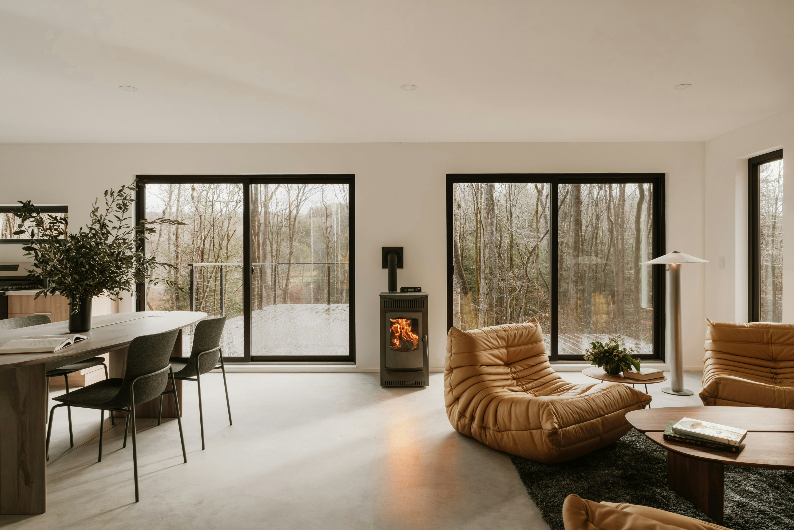
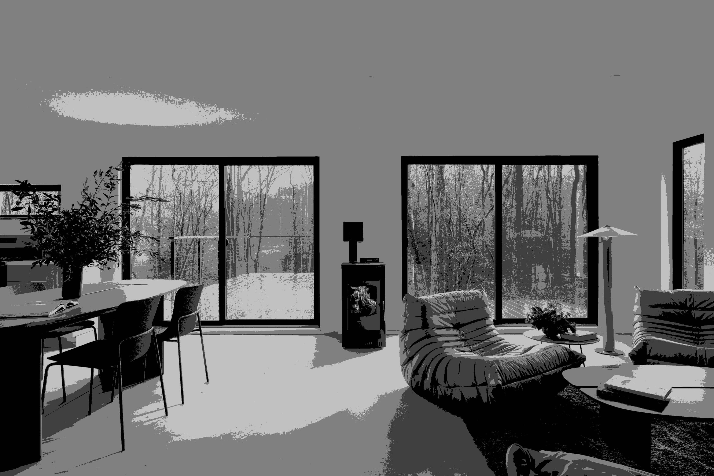
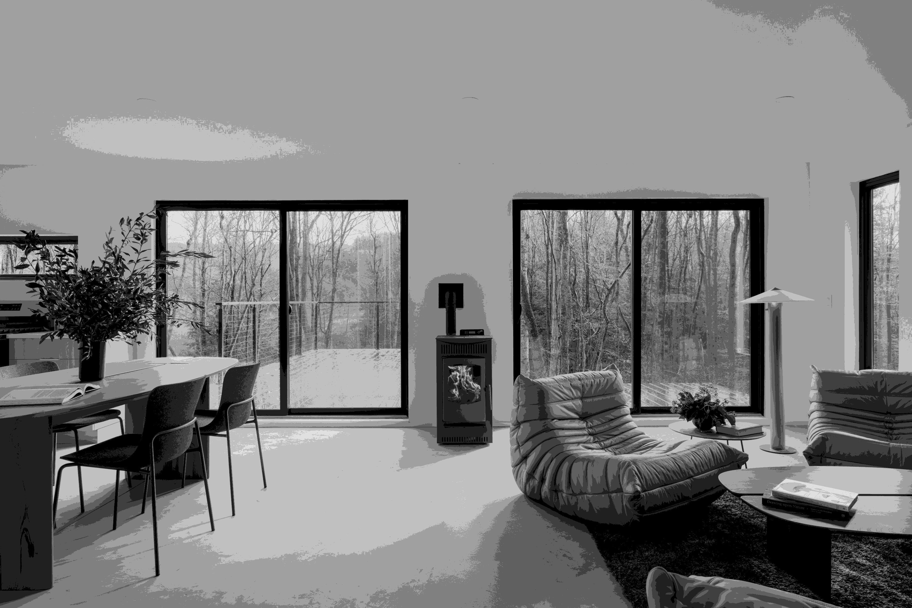
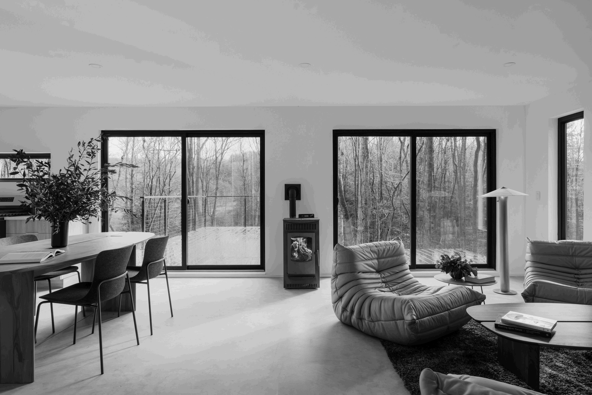
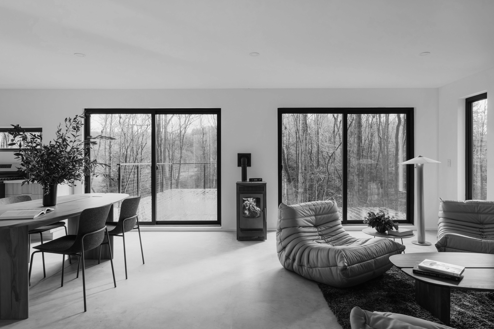

# Uniform Quantization

This Python script demonstrates the effect of applying uniform quantization to a grayscale image. Quantization is the process of reducing the number of distinct intensity values in an image. This implementation reduces the number of grayscales to a specified level.

The script processes an image by dividing the 256 possible grayscale values into a smaller number of bins. All pixels within a certain range are mapped to a single value, effectively reducing the color depth of the image. This can lead to visible contouring at lower quantization levels.

### Quantization Results

The following images show the effect of uniform quantization with different numbers of grayscales.

|                                     Original Image                                     |                                            2 Grayscales                                            |                                            4 Grayscales                                            |                                            8 Grayscales                                            |
| :------------------------------------------------------------------------------------: | :------------------------------------------------------------------------------------------------: | :------------------------------------------------------------------------------------------------: | :------------------------------------------------------------------------------------------------: |
|  |  |  |  |

|                                            16 Grayscales                                             |                                            32 Grayscales                                             |                                            64 Grayscales                                             |                                             128 Grayscales                                             |
| :--------------------------------------------------------------------------------------------------: | :--------------------------------------------------------------------------------------------------: | :--------------------------------------------------------------------------------------------------: | :----------------------------------------------------------------------------------------------------: |
|  |  |  |  |

### How to Run

1.  Install the required libraries:

    ```bash
    pip install numpy pillow
    ```

2.  Place your input images in the `data/` directory.

3.  Run the `main.py` script:

    ```bash
    python main.py
    ```

4.  The output images will be saved in the `out/` directory. The script will generate multiple versions of each input image, each quantized to a different number of grayscales (e.g., 2, 4, 8, 16, 32, 64, 128).
